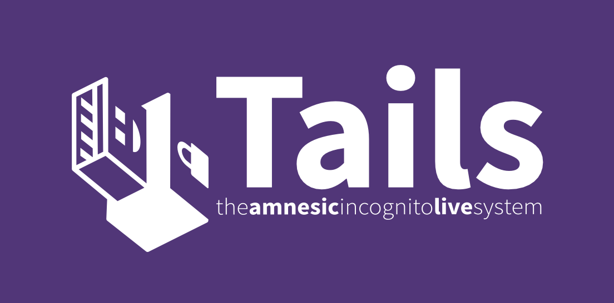
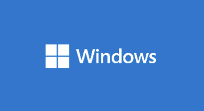
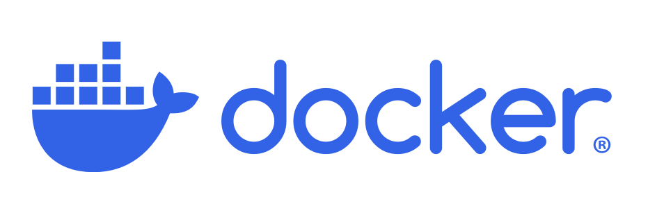
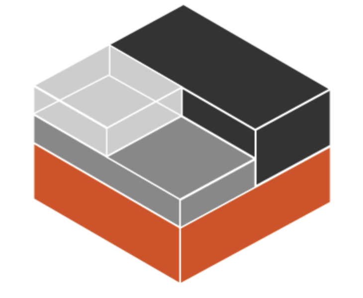
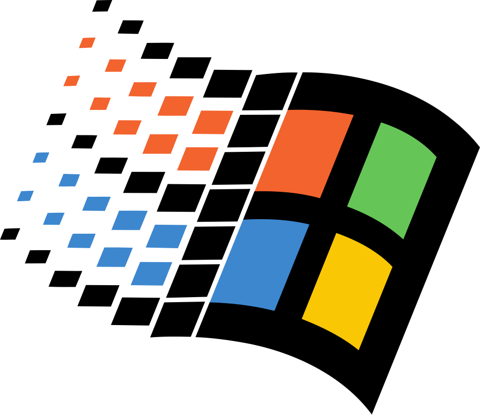

<p align="center">
  
</p>

<h1 align="center">BrowserBox by DOSAYGO</h1>

<p align="center">
  <strong>Secure Your Digital World with Enterprise-Grade Remote Browser Isolation (RBI)</strong>
</p>

<p align="center">
  <a href="https://dosaygo.com#license"></a>
  <a href="https://dosaygo.com"></a>
  <a href="https://dosaygo.com/nist800-53.html"></a>
  <a href="https://dosaygo.com/hipaa.html"></a>
  <a href="https://dosaygo.com/dlp.html"></a>
  <br>
  <a href="https://github.com/BrowserBox/BrowserBox/actions/workflows/bbx-saga.yaml"></a>
  <a href="https://github.com/BrowserBox/BrowserBox/actions/workflows/basic-install.yaml"></a>
</p>

<p align="center">
  <strong>AUGUST 2025 NEWS: Windows 9x support is in beta!<br>Bring safe modern browsing to legacy Win 9x systems and browsers.<br>See the <a href=#platform-compatibility>compatibility table</a> for details.</strong>
</p>

BrowserBox delivers cutting-edge remote browser isolation (RBI) technology, protecting your organization from web-based threats while empowering your team with seamless, secure browsing. **A product key is required for all BrowserBox usage.**

Unlock advanced security, ensure compliance, and boost productivity today!

---

## Table of Contents

1.  [Why Choose BrowserBox?](#why-choose-browserbox)
2.  [Key Benefits](#key-benefits)
3.  [Get Your License & Start Today!](#get-your-license--start-today)
4.  [Who Needs BrowserBox?](#who-needs-browserbox)
5.  [Core Features](#core-features)
6.  [See It In Action](#see-it-in-action)
7.  [Platform Compatibility](#platform-compatibility)
8.  [Get Started in 3 Steps](#get-started-in-3-steps)
    *   [1. Install the `bbx` CLI](#1-install-the-bbx-cli)
    *   [2. Purchase & Obtain Your Product Key](#2-purchase--obtain-your-product-key)
    *   [3. Activate & Run BrowserBox](#3-activate--run-browserbox)
9.  [Meet `bbx`: Your BrowserBox Command Center](#meet-bbx-your-browserbox-command-center)
10. [Embed BrowserBox Anywhere](#embed-browserbox-anywhere)
11. [Advanced Usage](#advanced-usage)
12. [License Compliance & Usage Data](#license-compliance--usage-data)
13. [Frequently Asked Questions (FAQ)](#frequently-asked-questions-faq)
14. [Support](#support)
15. [About DOSAYGO](#about-dosaygo)
16. [Sponsors](#sponsors)
17. [Copyright & Licensing](#copyright--licensing)

---

## Why Choose BrowserBox?

In today's threat landscape, standard browsing is a significant risk. BrowserBox provides a secure, isolated environment that neutralizes web-based threats *before* they reach your network or endpoints. It's an essential tool for:

*   **Protecting Sensitive Data:** Ideal for handling confidential information in healthcare (HIPAA), finance, and government (NIST 800-53).
*   **Secure Automation:** Safely automate web interactions, even with sensitive data.
*   **Compliance & DLP:** Meet stringent regulatory requirements and prevent data loss.
*   **Developer Productivity:** Easily embed secure browsing into applications.

## Key Benefits

*   **Unmatched Security:** Stop malware, ransomware, and zero-day attacks. Prevent costly data breaches.
*   **Effortless Integration:** Clientless RBI works in any browser. Embed secure browsing into your apps or protect local tabs with zero friction.
*   **Cross-Platform Power:** Runs on Windows, Linux (Debian, Ubuntu, RHEL, CentOS, NixOS), Docker, and LXC.
*   **Productivity Boost:** Features like Zero Latency Mode, customizable policies, and a mobile-first experience are built for modern teams.
*   **Developer Friendly:** Powerful `bbx` CLI and an easy-to-use Embedding API.

## Get Your License & Start Today!

BrowserBox requires a license for all use. Choose the option that's right for you:

*   🚀 **[Get a Commercial License](https://dosaygo.com/commerce)** - Starting at $99/user/year. Volume discounts available.
*   🌍 **[Get a Non-Commercial License](https://dosaygo.com/noncommercial)** - $39/user/year for non-profits, and government.
*   🧪 **[Request a Demo](mailto:sales@dosaygo.com?subject=Demo)** - Experience the full power of BrowserBox.
*   🛡️ **[Explore Solutions for Regulated Industries](https://dosaygo.com/regulated-enterprise.html)** - HIPAA, NIST 800-53, DLP, and more.

>[!CAUTION]
>Unlicensed instances will display a warning and shut down after a brief period. Ensure you have a valid product key for uninterrupted use.

## Who Needs BrowserBox?

*   **Businesses & Enterprises:** Safeguard your network, data, and employees from web-based threats.
*   **Regulated Industries (Healthcare, Finance, Government):** Ensure compliance (HIPAA, NIST 800-53), protect sensitive data, and implement robust DLP.
*   **Developers & Integrators:** Embed secure, isolated browsing directly into your applications and workflows.
*   **IT & Security Teams:** Deploy a scalable, manageable, and powerful RBI solution quickly.
*   **Automation Specialists:** Securely run Puppeteer & Playwright scripts in an isolated environment.

## Core Features

*   **Clientless Remote Browser Isolation (RBI):** No downloads or plugins needed for end-users. Access from any modern web browser.
*   **Comprehensive Platform Support:** Windows, major Linux distributions, Docker, LXC.
*   **Powerful `bbx` CLI Tool:** Manage installations, licenses, users, and run modes (including Tor).
*   **Easy Embedding API:** Integrate BrowserBox into your web applications with a simple `<browserbox-webview>` custom element.
*   **Automation Ready:** Designed for use with Puppeteer (PPtr) and Playwright (support coming soon).
*   **Security Focused:** Built-in DLP features, Tor support for anonymity, and robust access controls.
*   **1-Click Cloud Deployment (Coming Soon):** Easily deploy on Vultr, AWS, Azure, or Linode.

## See It In Action

BrowserBox provides a full-featured, secure browsing experience:

<div align="center">
  <figure style="display: inline-block; margin: 10px;">
    
    <figcaption>Secure Web Browsing</figcaption>
  </figure>
  <figure style="display: inline-block; margin: 10px;">
    
    <figcaption>Seamless PDF Viewing</figcaption>
  </figure>
  <figure style="display: inline-block; margin: 10px;">
    
    <figcaption>Powerful DevTools</figcaption>
  </figure>
  <figure style="display: inline-block; margin: 10px;">
    
    <figcaption>Full Browser Features (File Uploads, etc.)</figcaption>
  </figure>
</div>

## Platform Compatibility

BrowserBox runs seamlessly across a wide range of operating systems and containerization technologies:

| Platform                 | Supported | Icon                                                                                                |
| :----------------------- | :-------- | :-------------------------------------------------------------------------------------------------- |
| Tails\*                  | ❌        |     |
| Windows & Windows Server | ✅        |     |
| Debian                   | ✅        |                            |
| Ubuntu                   | ✅        |                            |
| CentOS Stream            | ✅        |              |
| RHEL                     | ✅        |              |
| NixOS                    | ✅        |                              |
| Docker                   | ✅        |                            |
| LXC                      | ✅        |                                    |
| Windows 9x†              | ✅        |               |

>[!NOTE]
>Run `bbx` (or `bbx install` on Windows) to ensure you have the latest version (v12+) with all fixes and features.

**Notes**

- \*Tails is not supported because neither Chrome nor Docker can be installed.
- †Windows 9x clients are supported by running the **new** `win9x_bbpro` command which will output the login link for legacy Windows clients (such as Internet Explorer (IE 5, IE 6, etc) or Netscape. Supported Windows 9x operating systems for legacy clients include Windows 95, Windows 98, Windows 2000, Windows NT the BrowserBox server must still be run on a modern system, but now you can connect to BrowserBox from legacy Windows 9x machines and browsers. Modern clients can still use the legacy endpoint but the experience is understandably jurassic.

## Get Started in 3 Steps

### 1. Install the `bbx` CLI

The `bbx` command-line interface is your primary tool for managing BrowserBox.

*   **Windows:**
    ```powershell
    irm bbx.dosaygo.com | iex
    ```
*   **Linux (Debian, Ubuntu, CentOS, RHEL, NixOS) & macOS & Docker:**
    ```bash
    bash <(curl -sSL https://bbx.sh.dosaygo.com) install
    ```
*   **Via NPM (@browserbox/browserbox):**
    ```bash
    npm i -g @browserbox/browserbox
    bbx-install
    ```

### 2. Purchase & Obtain Your Product Key

A product key is required.
*   **Commercial Use:** Starts at $99/user/year. [Purchase Commercial License](https://dosaygo.com/commerce).
*   **Non-Commercial Use:** $39/user/year (for non-profits, government). [Purchase Non-Commercial License](https://dosaygo.com/noncommercial).
*   **Evaluation:** [Request a Demo](mailto:sales@dosaygo.com?subject=Demo).

You can also purchase directly via the `bbx` CLI on Linux/macOS:
```console
bbx activate [number of people]
```

>[!IMPORTANT]
>After purchase, you'll receive an email with a secure link to view your **Product Key**. Save it safely; the link is single-use. Lost keys can be re-issued by contacting [Support](mailto:support@dosaygo.com) (evaluation keys cannot be rolled).

### 3. Activate & Run BrowserBox

*   **Windows:** Set the `LICENSE_KEY` environment variable:
    ```powershell
    $Env:LICENSE_KEY = "YOUR_BROWSERBOX_PRODUCT_KEY"
    ```
*   **Linux/macOS:** Use `bbx certify` to enter and save your Product Key (if not already saved via `bbx activate`).
    ```console
    bbx certify YOUR_BROWSERBOX_PRODUCT_KEY
    ```

Then, start BrowserBox:
```console
bbx setup  # Run once for initial configuration
bbx run
```
Access BrowserBox using the **Login Link** provided in your console. For public internet access, ensure your DNS records are configured correctly. View logs with `bbx logs` and stop with `bbx stop`.

---

## Meet `bbx`: Your BrowserBox Command Center

<a href="#meet-bbx-your-browserbox-command-center"></a>

The `bbx` CLI simplifies every aspect of BrowserBox management:

*   ✅ **Easy Installation & Updates:** `bbx install`, `bbx update`
*   💳 **License Management:** `bbx activate [number of seats]`, `bbx certify [product key]`
*   👩‍💻 **Multi-User Support:** Run BrowserBox for multiple users on a single machine.
*   🐳 **Docker Integration:** `bbx docker-run`
*   🧅 **Tor Anonymity:** `bbx tor-run`
*   ⚙️ **Core Operations:** `bbx run`, `bbx stop`, `bbx logs`, `bbx setup`
*   🌟 **And much more!** Run `bbx --help` for a full list of commands on your OS.

---

## Embed BrowserBox Anywhere

Easily integrate secure, remote browsing into your web applications using the BrowserBox Embedding API. Our `<browserbox-webview>` custom element allows you to add a fully isolated browser to any webpage.

**Quick Start:**

1.  **Configure Server:** Set `ALLOWED_EMBEDDING_ORIGINS` on your BrowserBox server:
    ```bash
    export ALLOWED_EMBEDDING_ORIGINS="https://your-embedding-site.com"
    bbx run
    ```
2.  **Add to HTML:** Include the script and element in your webpage:
    ```html
    <script src="https://raw.githubusercontent.com/BrowserBox/BrowserBox/main/api/browserbox-webview.js"></script>
    <browserbox-webview login-link="https://your-browserbox-instance.com/login/abc123" width="800" height="600"></browserbox-webview>
    ```
For more details, see the [browserbox-webview.js file](https://github.com/BrowserBox/BrowserBox/blob/main/api/browserbox-webview.js).

---

## Advanced Usage

*   **Secure Document Viewing:** Safely preview files without downloading them to the client device (Linux only).
*   **Developer Tools Access:** Inspect remote pages by right-clicking within the BrowserBox session.
*   **Tor & SSH Tunneling:** Enhance privacy and anonymity. Refer to the [Advanced Setup Guide](ADVANCE.md) (Note: `ADVANCE.md` link needs to be created or pointed correctly).

---

## License Compliance & Usage Data

BrowserBox requires a valid license for all deployments. We utilize usage data solely to ensure license compliance and for operational purposes. We never sell your data.
Please review our [Privacy Policy](https://dosaygo.com/privacy.txt.html) and [Terms of Service](https://dosaygo.com/terms.txt.html).

>[!IMPORTANT]
>A valid license unlocks all features, ensures ongoing support, and guarantees a secure, compliant solution.

---

## Frequently Asked Questions (FAQ)

**Q: Why is a license required for BrowserBox?**
A: Licensing supports continuous development, maintenance, and the advanced security features BrowserBox provides. It ensures we can deliver a robust, enterprise-grade RBI solution.

**Q: Do you offer perpetual licenses (non-subscription, version-locked)?**
A: Yes, for enterprise clients with an Annual Contract Value (ACV) of $150K+. Please contact [sales@dosaygo.com](mailto:sales@dosaygo.com) for inquiries.

**Q: How does BrowserBox compare to other RBI solutions?**
A: BrowserBox uniquely combines enterprise-grade security, extensive cross-platform compatibility (including Docker and multiple OS), an easy-to-use embedding API, and a powerful CLI, all in one package.

**Q: What do I receive when I purchase a license?**
A: You'll get an email with a secure, one-time link to view your product key. This key is valid for the number of seats purchased (adjustable during checkout). This is the same as the number of people who will use BrowserBox in your product or organization. For high volume or to negotiate custom pricing reach out to us. 

**Q: How can I purchase more licenses or get volume discounts?**
A: Volume discounts are available for commercial licenses and are automatically applied on our payment page. For custom packages or questions, contact [sales@dosaygo.com](mailto:sales@dosaygo.com). Non-commercial licenses have a flat rate.

**Q: I may have used BrowserBox without a license in the past. How can I become compliant?**
A: We understand situations can be complex. Please contact [legal@dosaygo.com](mailto:legal@dosaygo.com) to discuss your situation and achieve compliance. We're here to help you get on the right track.

**Q: Where can I find more information or ask other questions?**
A: Visit [dosaygo.com](https://dosaygo.com) or email [sales@dosaygo.com](mailto:sales@dosaygo.com).

---

## Support

Need help? Our team is ready to assist.
*   **Technical Support:** [support@dosaygo.com](mailto:support@dosaygo.com)
*   **Sales & Licensing:** [sales@dosaygo.com](mailto:sales@dosaygo.com)
*   **GitHub Issues:** For bug reports or feature requests related to the open-source components or `bbx` tool.

---

## About DOSAYGO

DOSAYGO (also known, due to an early incorporation typo, as DOSYAGO) is committed to building innovative and secure technology solutions. Our products include:
*   **BrowserBox:** Secure Remote Browser Isolation.
*   **DiskerNet:** Technology for creating offline archives of web content.

Visit us at [dosaygo.com](https://dosaygo.com).

---

## Sponsors

We are grateful for the support of our sponsors. If you're interested in sponsoring BrowserBox development, please contact [sales@dosaygo.com](mailto:sales@dosaygo.com).

---

## Copyright & Licensing

BrowserBox™ is &copy; 2018-2025 DOSAYGO Corporation USA. All rights reserved.
The `bbx` CLI tool and other specified components are open source under the [LICENSE.md](LICENSE.md) in this repository. The core BrowserBox server product requires a commercial license.

---

<p align="center">
  <strong>Ready to secure your browsing?</strong><br>
  <a href="https://dosaygo.com/commerce">Get Your Commercial License</a> | <a href="https://dosaygo.com/noncommercial">Get Your Non-Commercial License</a> | <a href="mailto:sales@dosaygo.com?subject=Demo">Request a Demo</a>
</p>
