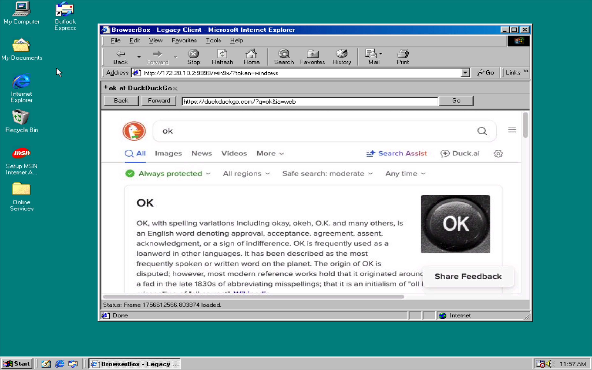

<p align="center">
  
</p>

<h1 align="center">BrowserBox by DOSAYGO</h1>

<p align="center">
  <strong>Secure, modern Remote Browser Isolation (RBI) with a clientless experience</strong>
</p>

<p align="center">
  <a href="https://dosaygo.com#license"></a>
  <a href="https://dosaygo.com"></a>
  <a href="https://dosaygo.com/nist800-53.html"></a>
  <a href="https://dosaygo.com/hipaa.html"></a>
  <a href="https://dosaygo.com/dlp.html"></a>
  <br>
  <a href="https://github.com/BrowserBox/BrowserBox/actions/workflows/bbx-saga.yaml"></a>
</p>

<p align="center">
  <strong>🆕 FEBRUARY 2026:</strong> Windows 98½ Demo now live!<br>
  Try BrowserBox with our nostalgic <a href="https://win9-5.com/demo">Windows 98½ demo</a> — free 17-minute cloud browser sessions, no signup required.<br>
  <strong>Cloud API:</strong> Purchase minutes and create on-demand cloud browser sessions via REST API.<br>
  <a href="https://win9-5.com/api/">API Docs</a> · <a href="https://win9-5.com/pricing/">Pricing</a> · <a href="https://win9-5.com/demo">Live Demo</a>
</p>

---

BrowserBox is a remote browser isolation (RBI) platform. It streams a full, modern browser to any client — 60 FPS, low latency — and runs on Windows, Linux, and containers. **A product key is required for all self-hosted usage.**

**At a glance:**
- Clientless RBI — no plugins, no downloads for end users
- 60 FPS streaming with real responsiveness
- Embeds anywhere via `<browserbox-webview>`
- Cloud API for ephemeral sessions, no self-hosting needed
- Works on Windows, Linux, and containers like Podman, and LXC
- Policy controls, DLP, and audit-friendly workflows

[Live Demo](https://win9-5.com/demo) | [Cloud API](https://win9-5.com/api/) | [Pricing](https://win9-5.com/pricing/) | [Customer Guide](./docs/BrowserBox_Customer_Guide_v16.2.0.pdf) | [Support](mailto:api@browserbox.io)

Official sites: [BrowserBox](https://browserbox.io), [DOSAYGO](https://dosaygo.com), [CloudTabs](https://browse.cloudtabs.net)

---

> **Notice: Legacy source code removed (March 2026)**
>
> When BrowserBox transitioned to a binary distribution model in late 2025, we retained legacy source code in this repository for a six-month period to give existing customers time to migrate. That period is now over and all legacy source has been removed.
>
> Current BrowserBox source is private and proprietary. It diverges significantly from the legacy code that was previously housed here -- by over 1,000 commits -- with extensive bug fixes, security hardening, and performance enhancements that are absent from the legacy codebase and any forks thereof.
>
> Legacy source code may still be visible in third-party forks as a historical curiosity. That code is **not open source**. Permission is **not** granted to use that source in your products, to train AI models, or to re-implement BrowserBox functionality from it. These acts violate BrowserBox terms. See [LICENSE.md](LICENSE.md) and [TRADEMARK.md](TRADEMARK.md).
>
> Current source is available to customers above a threshold ACV as part of due diligence, on request. Contact [sales@dosaygo.com](mailto:sales@dosaygo.com).

---

## Table of Contents

1. [Why BrowserBox?](#1-why-browserbox)
2. [Key Benefits](#2-key-benefits)
3. [Who Uses It](#3-who-uses-it)
4. [Real-World Use Cases](#4-real-world-use-cases)
5. [Core Features](#5-core-features)
6. [What's New](#6-whats-new)
7. [See It In Action](#7-see-it-in-action)
8. [Supported Network Topologies](#8-supported-network-topologies)
9. [Platform Compatibility](#9-platform-compatibility)
10. [Install](#10-install)
11. [Quick Start](#11-quick-start)
12. [Documentation](#12-documentation)
13. [GitHub Actions](#13-github-actions)
14. [Cloud API](#14-cloud-api)
15. [Embed BrowserBox](#15-embed-browserbox)
16. [Advanced Usage](#16-advanced-usage)
17. [License Compliance & Privacy](#17-license-compliance--privacy)
18. [FAQ](#18-faq)
19. [Licensing](#19-licensing)
20. [Support](#20-support)
21. [About DOSAYGO](#21-about-dosaygo)

---

## 1. Why BrowserBox?

The web is genuinely dangerous, and standard browsing pushes that risk directly onto your network and your endpoints. BrowserBox flips the model: the browser runs on a server you control, and clients receive a rendered stream — so malware, exploits, and sketchy sites never touch user devices. Security teams get isolation without fighting users over endpoint agents. SaaS builders can embed a full browsing experience into their products without headless brittleness. Regulated organizations get audit trails and DLP controls baked in.

- Threat containment: browser exploits hit the server, not the endpoint
- True clientless access: any modern browser, zero installs for end users
- Embeddable: build web products that include real, live browsing
- Automation-ready: a real browser, not a headless approximation

---

## 2. Key Benefits

- **Threat isolation:** malware, exploits, and bad sites hit the server — not client devices
- **Clientless:** works in any browser, zero install for end users
- **Cross-platform:** Windows, Linux (Debian, Ubuntu, RHEL, CentOS, NixOS), and containers like LXC
- **Smooth UX:** low-latency rendering, 60 FPS
- **Solid CLI and embedding API** for builders and integrators

---

## 3. Who Uses It

- **Security teams** — isolate browsing risk from corporate endpoints
- **SaaS builders and integrators** — embed live browser sessions in products
- **IT and ops** — access internal web UIs from anywhere, without broad network exposure
- **Automation and QA** — run real browser workflows without headless fragility
- **Regulated orgs** — healthcare, finance, government — where audit trails and DLP policies aren't optional

---

## 4. Real-World Use Cases

### Home Lab: The Always-On Jump Browser

If you run a Synology NAS or any always-on home server, BrowserBox fits in naturally as a private jump browser for your local network. Install it once via CLI, and you've got a streamed Chrome session you can reach from any device — phone, laptop, whatever's in your hand — that can immediately access your router admin panel, IP cameras, smart home hubs, printers, and any other internal web UI that normally requires being on the same LAN.

No port forwarding maze. No VPN just to check one device. You expose a single protected BrowserBox session, secured by token, and everything behind it stays private. Trigger large downloads and they land directly on NAS drives — no extra hops, no cloud middleman. When a site throws a captcha or anti-bot wall, just handle it visually in the remote browser. It's your network. This is how you reach it cleanly.

### Enterprise: Secure Remote Browser Gateway

In corporate, government, healthcare, and financial environments, BrowserBox acts as a secure browser gateway deployed inside a protected network. Teams, contractors, and vendors reach internal web applications, intranets, admin panels, and legacy systems — without installing software on their devices or opening broad network access to your infrastructure.

Admins control copy-paste, file uploads and downloads, printing, and keyboard inputs per user or session. DLP policies keep sensitive information contained inside the isolated browser. Every action is auditable. Malware and exploits are contained server-side. Whether you're managing compliance with HIPAA, financial regulations, or government security requirements, the controls are there — and they're not bolted on as an afterthought.

Same core idea, two very different worlds: keep the browser where you can watch it, and stream the view to wherever people actually are.

---

## 5. Core Features

- **Clientless RBI** — access from any modern browser, no install required for end users
- **Cross-platform** — Windows, Debian, Ubuntu, RHEL, Rocky Linux, CentOS, NixOS, and containers like LXC
- **`bbx` CLI** — manage install, licenses, users, run modes, and tunnels from the command line
- **`<browserbox-webview>` embedding API** — drop a live browser session into any web product
- **Cloud API** — purchase minute packs and spin up ephemeral sessions via REST, no self-hosting
- **Automation-ready** — a real browser; Puppeteer and Playwright integrations coming
- **DLP, Tor support, access controls** — policy enforcement built in, not bolted on
- **1-click cloud deployment** — coming soon

---

## 6. What's New

- **Cloud API** — purchase minute packs at [win9-5.com/pricing](https://win9-5.com/pricing/) and create ephemeral browser sessions via REST. No server to manage.
- **Windows 98½ Demo** — free 17-minute cloud sessions at [win9-5.com/demo](https://win9-5.com/demo), no signup.
- **Flipbook Recording** — record any browsing session as a self-contained static flipbook site. Deploy to Cloudflare Pages with one command.
- **Binary release system** — BrowserBox now ships as a signed binary. Install with one command, update the same way.
- **60 FPS streaming** — real-time, low-latency rendering for a browsing experience that actually feels like a browser.
- **Unified install endpoints** — `browserbox.io/install.sh` (Linux/macOS) and `browserbox.io/install.ps1` (Windows).

---

## 7. See It In Action

<div align="center">
  <figure style="display: inline-block; margin: 10px;">
    
    <figcaption>Secure Web Browsing</figcaption>
  </figure>
  <figure style="display: inline-block; margin: 10px;">
    
    <figcaption>Seamless PDF Viewing</figcaption>
  </figure>
  <figure style="display: inline-block; margin: 10px;">
    
    <figcaption>Powerful DevTools</figcaption>
  </figure>
  <figure style="display: inline-block; margin: 10px;">
    
    <figcaption>Full Browser Features (File Uploads, etc.)</figcaption>
  </figure>
</div>

---

## 8. Supported Network Topologies

BrowserBox isn't fussy about how your network is wired. Whether you're behind a corporate NAT, routing through Tor, or running a Cloudflare tunnel for a quick demo, it fits in without requiring you to restructure anything. The table below covers the supported topologies — pick what matches your situation.

| Topology | Description | Public Access? | Key Features & Benefits | OS Support (Ubuntu/macOS/Windows) | Best For |
|----------|-------------|----------------|--------------------------|------------------------------------|----------|
| **HTTP Only** | Basic unencrypted HTTP connections for quick, lightweight access. | Yes (if exposed) | Simple setup; ideal for internal testing or low-security demos. Supports custom ports (e.g., 8080, 9999, 11111) or standard (80). | ✅ / ✅ / ✅ | Rapid prototyping in trusted networks. |
| **HTTP/WS** | HTTP with WebSocket support for real-time bidirectional communication. | Yes (if exposed) | Enables interactive apps; pairs with custom/standard ports for flexibility. | ✅ / ✅ / ✅ | Chat apps, live updates, or collaborative tools. |
| **HTTPS/WSS/WebRTC** | Secure HTTPS with WebSocket Secure and WebRTC for encrypted, peer-to-peer media streaming. | Yes (if exposed) | End-to-end encryption; auto-cert handling; custom/standard ports (443 default). | ✅ / ✅ / ✅ | Video calls, secure file sharing, or real-time collaboration in production. |
| **Tor/HTTP** | Tor onion service over HTTP for pseudonymous access. | Yes (via .onion) | High privacy; bypasses censorship; slow but reliable. Requires Tor Browser. | ✅ / ✅ / ✅ | Privacy-focused demos or restricted environments. |
| **Tor/HTTPS** | Secure Tor onion service with HTTPS encryption. | Yes (via .onion) | Adds TLS to Tor for extra security; reliable NAT traversal. | ✅ / ✅ / ✅ | Anonymous secure access in high-threat scenarios. |
| **SSH Port Forward, HTTP** | SSH-based port forwarding tunneling HTTP traffic. | No (private) | Secure, low-latency; forwards to custom/standard ports. Upcoming auto-cert orchestration. | ✅ / ✅ / ✅ | Private homelab access or secure internal routing. |
| **SSH Port Forward, HTTPS** | SSH forwarding with HTTPS for encrypted tunnels. | No (private) | Combines SSH reliability with TLS; flexible port options. Native enhancements incoming. | ✅ / ✅ / ✅ | Enterprise-grade secure remote sessions. |
| **Custom Ports** | User-defined ports (e.g., 8080, 9999, 11111) across any protocol. | Varies | Total control; avoids conflicts; integrates with all topologies. | ✅ / ✅ / ✅ | Tailored setups for specialized apps or multi-service hosts. |
| **Standard Ports** | Default ports (e.g., 80 for HTTP, 443 for HTTPS) for seamless compatibility. | Varies | Plug-and-play; reduces config overhead in standard environments. | ✅ / ✅ / ✅ | Quick deployments matching common infrastructure. |
| **Cloudflare Tunnel** | HTTPS DNS facade with port relay via Cloudflare's edge network. | Yes (*.trycloudflare.com) | Auto-install; high reliability; great perf. Native `bbx cf-run` support soon. | ✅ / ✅ / ✅ | Quick public demos with origin privacy. |
| **localhost.run** | SSH reverse tunnel with HTTPS facade. | Yes (http(s)://…lhr.life) | Zero-config; medium reliability; occasional interstitials. | ✅ / ✅ / ✅ | Free, easy links for casual sharing. |
| **ngrok** | Port relay with HTTPS and auth token for secure exposure. | Yes (*.ngrok-free.app) | High perf; webhooks ready; free tier limits (1 tunnel). Token required. | ✅ / ✅ / ✅ | Shareable demos and webhook testing. |
| **Pinggy** | Port relay with HTTPS; may have interstitials. | Yes (*.pinggy.io) | Fair reliability; okay perf. | ✅ / ✅ / ℹ️ (Limited on Windows) | Budget-friendly webhooks and demos. |
| **Tailscale** | Overlay network for private, LAN-like access. | No (private tailnet) | Very high reliability; low latency. SSH forwarding; token required. Less stable on Windows/VPN. | ✅ / ✅ / ℹ️ (SSH not upstream-supported on Windows) | Private team debugging and access. |
| **Tor** | Onion routing for pseudonymous, reliable access. | Yes (.onion) | Extremely reliable (but slow); privacy-first. We already have `bbx tor-run`. | ✅ / ✅ / ✅ | Censorship-resistant, anonymous deployments. |
| **Tunnelmole** | OSS ngrok-style relay with HTTPS. | Yes (https://…tunnelmole.net/.com) | High reliability; good perf; auto-install. | ✅ / ✅ / ✅ | Open-source demos with easy URLs. |
| **ZeroTier** | Overlay network for peer-to-peer private access. | No (private network) | LAN-like; very high reliability. Native `bbx zt-run` support soon. Tokens required; client on access device. | ✅ / ✅ / ✅ | Secure P2P demos in overlays. |

**Notes on Flexibility & Power:**
- BrowserBox supports mixing and matching topologies — you can run HTTPS with a Cloudflare tunnel on custom ports, or Tor over SSH forwarding. The topology is yours to compose.
- The `bbx` CLI handles tunnel setup, cert orchestration, and run modes in one place, so you're not stitching together a dozen separate tools to get a working deployment.

---

## 9. Platform Compatibility

BrowserBox runs where real work happens — here's the current support matrix.

| Platform                 | Supported | Icon |
| :----------------------- | :-------- | :--- |
| Tails\*                  | ❌        |  |
| Windows & Windows Server | ✅        |  |
| Debian                   | ✅        |  |
| Ubuntu                   | ✅        |  |
| CentOS Stream            | ✅        |  |
| RHEL                     | ✅        |  |
| Rocky Linux              | ✅        |  |
| NixOS                    | ✅        |  |
| LXC                      | ✅        |  |
| Podman                   | ✅        |  |
| Windows 9x†              | ✅        |  |

>[!NOTE]
>Run `bbx` (or `bbx install` on Windows) to ensure you have the latest version (v13+) with all fixes and features.

\*Tails is not supported because Chrome cannot be installed.


†Windows 9x clients are supported via the `bbx win9x-run` command which outputs the login link for legacy clients (IE 5, IE 6, Netscape). Supported client OSes: Windows 95, 98, 2000, NT. The server still needs to run on a modern system. Modern clients can use the legacy endpoint too, but the experience is understandably retro.

<p align=center>
  
</p>

---

## 10. Install

### Linux & macOS

```bash
curl -fsSL https://browserbox.io/install.sh | bash
```

### Windows

```powershell
irm https://browserbox.io/install.ps1 | iex
```

### Via npm

```bash
npm i -g @browserbox/browserbox
```

---

## 11. Quick Start

```bash
bbx install
bbx certify YOUR_PRODUCT_KEY
bbx setup
bbx run
```

---

## 12. Documentation

- [Customer Guide (PDF)](./docs/CUSTOMER-GUIDE.pdf)

---

## 13. GitHub Actions

Launch BrowserBox directly on a GitHub Actions runner with [BrowserBox/browserbox-action](https://github.com/BrowserBox/browserbox-action).

- Supports `tunnel: none`, `cloudflare`, and `tor`
- Defaults to a minimal runner footprint with `BBX_MINIMAL_MODE=true`
- Disables update checks during runner launches with `BBX_NO_UPDATE=true`
- Requires a BrowserBox license key from [browserbox.io](https://browserbox.io)

```yaml
jobs:
  browserbox:
    runs-on: ubuntu-latest
    steps:
      - name: Launch BrowserBox
        id: browserbox
        uses: BrowserBox/browserbox-action@v1
        with:
          license-key: ${{ secrets.BROWSERBOX_LICENSE_KEY }}
          tunnel: cloudflare

      - name: Print login link
        run: echo "${{ steps.browserbox.outputs.login-link }}"
```

---

## 14. Cloud API

Create on-demand ephemeral browser sessions without self-hosting. Purchase minute packs and manage sessions via REST.

```bash
curl -X POST https://win9-5.com/api/v1/sessions \
  -H "Authorization: Bearer YOUR_API_KEY" \
  -H "Content-Type: application/json" \
  -d '{"minutes": 15}'
```

Full API documentation: [win9-5.com/api](https://win9-5.com/api/)

---

## 15. Embed BrowserBox

```html
<script src="https://win9-5.com/browserbox-webview.js" type="module"></script>
<browserbox-webview
  login-link="https://your-instance.com/login/abc123"
  width="1024"
  height="768">
</browserbox-webview>
```

The `<browserbox-webview>` element provides a session-host API with namespaced surfaces for tabs, pages, capture, augmentation, selection, and policy-gated capability control.

---

## 16. Advanced Usage

- **Secure document viewing** — open PDFs and sensitive files in the remote browser without ever downloading them to the client device (Linux only)
- **Remote DevTools** — right-click in any BrowserBox session to access full Chrome DevTools running in the isolated environment
- **Tor and SSH tunneling** — `bbx tor-run` for anonymous onion-routed access; SSH port forwarding for private, low-latency internal routing

---

## 17. Flipbook Recording

BrowserBox can record a browsing session as a **flipbook** — a self-contained static site of sequential JPEG frames with an interactive JavaScript viewer. Recordings are produced directly from the internal screencast pipeline with negligible overhead.

### Quick Start

```bash
# Enable recording during setup
bbx setup --flipbook-record ~/my-recording --flipbook-description "Demo walkthrough"

# Run BrowserBox normally
bbx run

# Stop — frames are compiled into a flipbook site and optionally deployed
bbx stop
```

### How It Works

1. `bbx setup --flipbook-record <dir>` enables recording by writing `BBX_FLIPBOOK_DIR` to the BrowserBox config.
2. At runtime, each screencast frame is captured as a JPEG + JSON metadata pair — zero overhead when recording is off (single boolean check per frame).
3. On `bbx stop`, the built-in `browserbox flipbook-generate` command compiles the raw frames into a complete flipbook static site.
4. If [Cloudflare Wrangler](https://developers.cloudflare.com/workers/wrangler/) is available, the site is deployed to Cloudflare Pages automatically.

### Output

Each recording produces a timestamped directory:

```
~/my-recording/
  2026-04-14T02-25-00-000Z--2026-04-14T02-30-00-000Z/
    site/
      index.html        # self-contained viewer
      manifest.json     # flipbook v1 manifest
      pages/            # sequential JPEG frames (000000.jpg, 000001.jpg, ...)
      assets/           # viewer.css, viewer.js, sw.js
      meta/             # provenance.json with full per-frame metadata
```

Multiple runs to the same directory produce separate timestamped subdirectories — each is a standalone flipbook site that can be served with any static file server or deployed to any hosting platform.

### Options

| Flag | Description |
|------|-------------|
| `--flipbook-record <dir>` | Enable recording. Compiled flipbook sites are written here. |
| `--flipbook-description <text>` | Optional description embedded in the manifest and provenance metadata. |

---

## 18. License Compliance & Privacy

BrowserBox requires a valid license for all deployments — commercial, non-commercial, and evaluation. Usage data is collected solely for license compliance and operational purposes; it is never sold, never shared with third parties for marketing, and never used to profile users.

>[!IMPORTANT]
>A valid license unlocks all features, ensures ongoing support, and guarantees a secure, compliant solution.

---

## 19. FAQ

**Q: Can I get an evaluation license?**
Yes. Apply for a free 7-day trial at [browserbox.io](https://browserbox.io). No credit card required to evaluate.

**Q: Why is a license required?**
BrowserBox is commercial software. A license funds continued development, security research, and support. It also gives you a legitimate, supportable deployment — not a fork of old code that diverged 1,000+ commits ago.

**Q: Do you offer perpetual licenses?**
Current licensing is subscription-based. Enterprise arrangements, including perpetual options, are available — contact [sales@dosaygo.com](mailto:sales@dosaygo.com).

**Q: How does BrowserBox compare to other RBI solutions?**
Most RBI products are cloud-only, expensive at scale, or require proprietary endpoint agents. BrowserBox runs on your own infrastructure (or ours via Cloud API), works with any client browser, and gives you genuine control over the deployment. It's also the only RBI platform with a Windows 98½ demo, for what that's worth.

**Q: What do I receive when I purchase?**
A product key that activates `bbx`, access to all current platform binaries, documentation, and support channels. Enterprise customers above a threshold ACV can request source access for due diligence.

**Q: How can I get volume discounts?**
Contact [sales@dosaygo.com](mailto:sales@dosaygo.com) for volume pricing, multi-year agreements, and enterprise terms.

**Q: I may have used BrowserBox without a license. How do I become compliant?**
Reach out to [sales@dosaygo.com](mailto:sales@dosaygo.com). We handle compliance situations directly and without unnecessary drama — the goal is to get you licensed and supported, not to make things difficult.

---

## 20. Licensing

BrowserBox is a commercial product. All usage requires a valid license.

- **Commercial:** Starts at $119/user/year. [Purchase](https://dosaygo.com/commerce)
- **Non-Commercial:** $49/user/year (non-profits, government). [Purchase](https://dosaygo.com/noncommercial)
- **Evaluation:** [Apply for a 7-day trial](https://browserbox.io)
- **Enterprise / Source Access:** [sales@dosaygo.com](mailto:sales@dosaygo.com)

---

## 21. Support

- **API & Technical:** [api@browserbox.io](mailto:api@browserbox.io)
- **General:** [support@dosaygo.com](mailto:support@dosaygo.com)
- **Sales & Licensing:** [sales@dosaygo.com](mailto:sales@dosaygo.com)

---

## 22. About DOSAYGO

DOSAYGO — do, say, go — those are three of the most universal human verbs, after "to be" (which no company has any business telling you what to do with). We're a small team building software that respects the people using it. Our products are BrowserBox (remote browser isolation) and DiskerNet (offline web archives). We don't do buzzwords. We ship things that work. Find us at [dosaygo.com](https://dosaygo.com).

---

<p align="center">
  <strong>Ready to get started?</strong><br>
  <a href="https://dosaygo.com/commerce">Commercial License</a> · <a href="https://dosaygo.com/noncommercial">Non-Commercial License</a> · <a href="mailto:sales@dosaygo.com?subject=Demo">Request a Demo</a>
</p>

BrowserBox&trade; is &copy; 2018-2026 DOSAYGO Corporation USA. All rights reserved.

[dosaygo.com](https://dosaygo.com) | [browserbox.io](https://browserbox.io) | [CloudTabs](https://browse.cloudtabs.net)
