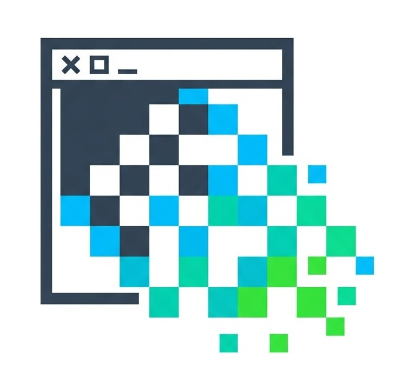
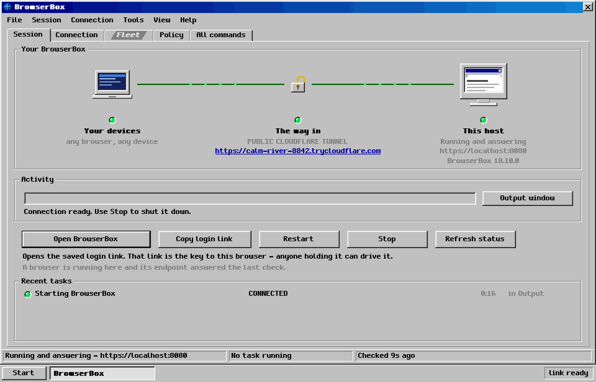
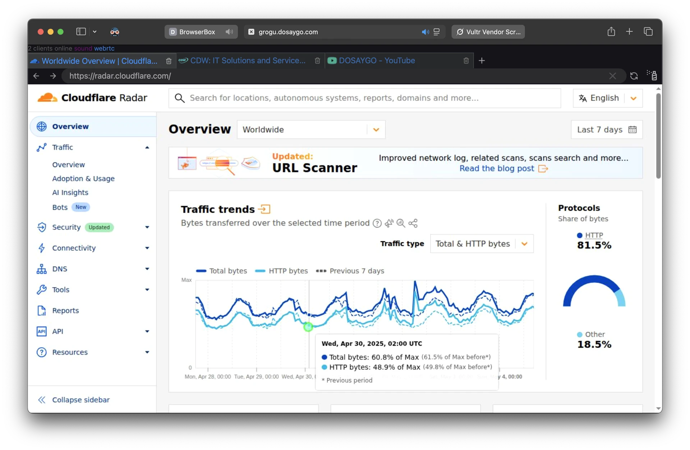
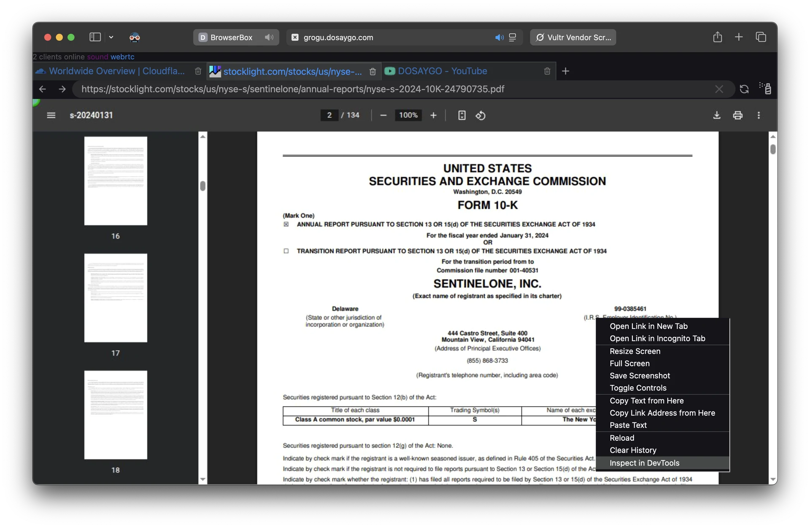
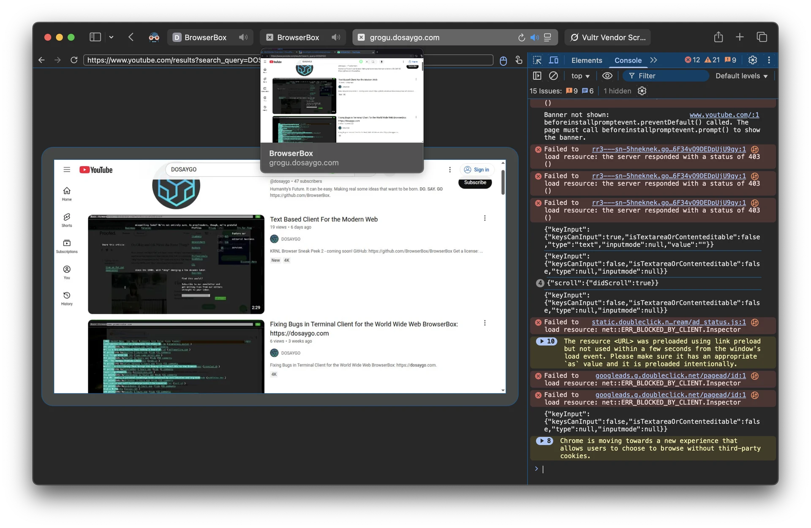
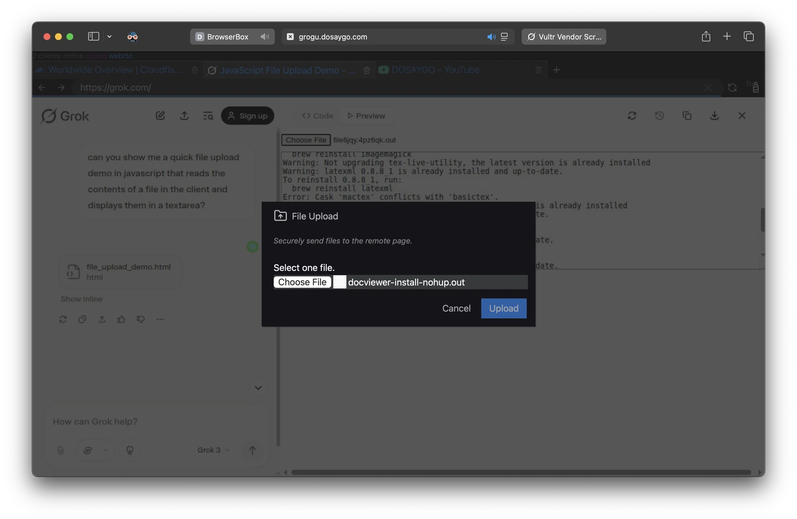
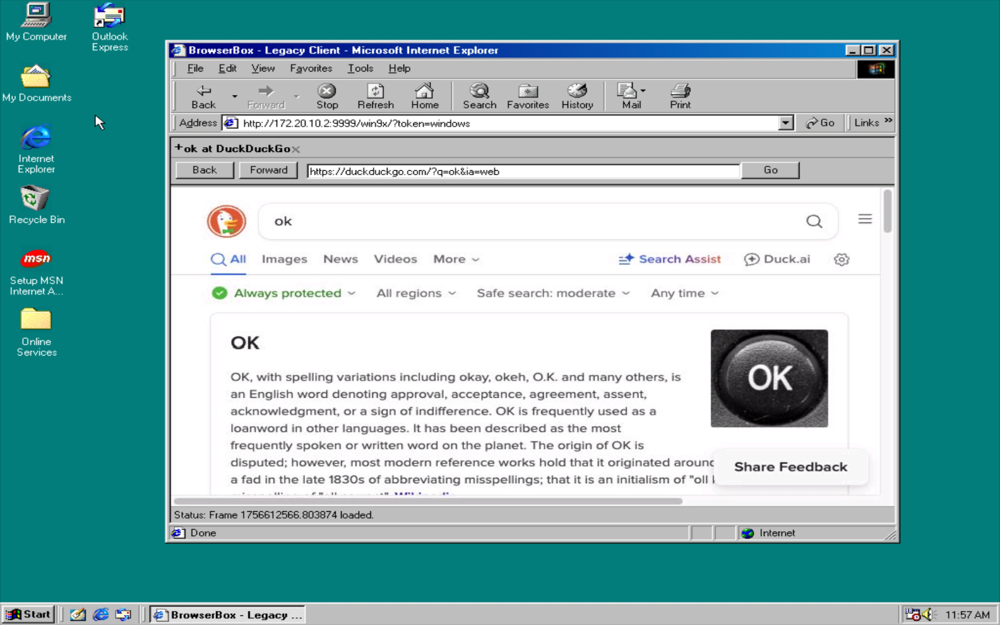

<p align="center">
  
</p>

<h1 align="center">BrowserBox — Remote Browser Isolation</h1>

<p align="center">
  <strong>A full remote browser. Clientless access. Native performance.</strong><br>
  Self-host on Windows, macOS or Linux, or create cloud browser sessions through the API.
</p>

<p align="center">
  <a href="https://browserbox.io/evaluate"><strong>Start a 7-Day Paid Evaluation</strong></a> ·
  <a href="https://dosaygo.com/commerce"><strong>Buy a Commercial License</strong></a> ·
  <a href="mailto:sales@dosaygo.com?subject=BrowserBox%20Enterprise%20Demo">Talk to Sales</a>
</p>

<p align="center">
  <a href="https://browserbox.io">Website</a> ·
  <a href="https://win9-5.com/demo">Live Demo</a> ·
  <a href="https://docs.browserbox.io/">Documentation</a> ·
  <a href="https://github.com/BrowserBox/BrowserBox/releases/latest">Latest Release</a>
</p>

**BrowserBox is a remote browser isolation (RBI) platform for secure web access, browser automation, and embedded browsing.** It runs a full browser on a remote host and streams the rendered view to your users, with support for 60 FPS streaming. Give employees and contractors access to web applications, investigate untrusted sites, or add a live browser to your product. End users connect from a modern web browser without installing an agent or plugin.

**As of v20, BrowserBox's production runtime is written entirely in [freelang](https://freelang.dev/) and compiled to a self-contained native executable.** The familiar `bbx` commands, configuration, policies, and login links carry forward. [Read about the freelang architecture](#built-with-freelang).

BrowserBox is commercial software. A valid license is required for all use, including development and evaluation. [Compare licensing options](#20-licensing) or [try the hosted demo](https://win9-5.com/demo) before planning a deployment.

## Table of Contents

1. [Why BrowserBox?](#1-why-browserbox)
2. [Key Benefits](#2-key-benefits)
3. [Who Uses It](#3-who-uses-it)
4. [Real-World Use Cases](#4-real-world-use-cases)
5. [Core Features](#5-core-features)
6. [What's New in v20 & Freelang](#6-whats-new)
7. [See It In Action](#7-see-it-in-action)
8. [Supported Network Topologies](#8-supported-network-topologies)
9. [Platform Compatibility](#9-platform-compatibility)
10. [Install](#10-install)
11. [Quick Start](#11-quick-start)
12. [Documentation](#12-documentation)
13. [GitHub Actions](#13-github-actions)
14. [Cloud API](#14-cloud-api)
15. [Embed BrowserBox](#15-embed-browserbox)
16. [Advanced Usage](#16-advanced-usage)
17. [Flipbook Recording](#17-flipbook-recording)
18. [License Compliance & Privacy](#18-license-compliance--privacy)
19. [FAQ](#19-faq)
20. [Licensing](#20-licensing)
21. [Support](#21-support)
22. [About DOSAYGO](#22-about-dosaygo)

---

## 1. Why BrowserBox?

Move web browsing into infrastructure you control. With BrowserBox, remote websites execute on the host while users interact with a streamed view. This separates website execution from the endpoint and gives your team a central place to manage browsing policy, access, and sessions.

Deploy a **self-hosted remote browser** inside your network for access to internal applications, run isolated sessions for security work, or use the **Cloud API** when you want on-demand capacity without managing servers. The same browsing experience can also be embedded in your own application with [Hyper-Frame](https://www.hyper-frame.art).

[Evaluate BrowserBox on your infrastructure](https://browserbox.io/evaluate) or [discuss an enterprise deployment](mailto:sales@dosaygo.com?subject=BrowserBox%20Enterprise%20Deployment).

## 2. Key Benefits

- **Reduce endpoint exposure.** Run untrusted web content on a remote host, with browser policy enforced in the session.
- **Simplify access.** Users open a login link in their existing browser; no endpoint agent or browser extension is required.
- **Keep browsing responsive.** Support for 60 FPS streaming, WebRTC transport, and WebSocket fallback. Actual performance depends on the host, workload, and network.
- **Choose where sessions run.** Deploy on your own Windows, macOS, or Linux systems, or purchase hosted browser minutes.
- **Build browser features into your product.** Embed a live session and control navigation, tabs, and capture through the Hyper-Frame API.
- **Manage concurrent users.** Linux Fleet pools let you run multiple isolated seats on one host, with capacity and health visible in the desktop app.

## 3. Who Uses It

| Team | What BrowserBox helps you do |
| :--- | :--- |
| Security and IT | Isolate browsing activity, investigate suspicious sites, and enforce session policy. |
| Enterprise operations | Give employees, contractors, and vendors browser access to internal web applications. |
| SaaS builders and integrators | Add interactive remote browsers to customer portals, workflows, and support tools. |
| Automation and QA | Automate browser workflows and let a person take over the same session when needed. |
| Healthcare, finance, and government | Apply browsing restrictions, data loss prevention controls, and policy logging within your deployment. |

## 4. Real-World Use Cases

### Enterprise: Secure Remote Browser Gateway

Place BrowserBox inside a protected network and give authorized users access to intranets, admin consoles, and business applications through a remote browser. Users can work from their existing devices while administrators control which sites and browser capabilities the session permits.

Manage clipboard access, uploads, downloads, printing, and developer tools through policy. Navigation allowlists and private-network restrictions let you tailor access to each workflow, while policy decision logs support review. [Talk to sales](mailto:sales@dosaygo.com?subject=BrowserBox%20Enterprise%20Demo) about seat capacity, deployment requirements, and support.

### SaaS: An Embedded Browser for Your Product

Use `<hyper-frame>` to put a live browser inside your application. Build guided onboarding, interactive demos, support sessions, or automation with human handoff. Use your own BrowserBox deployment or create paid cloud sessions through REST, then pass the session's login URL to the embedding component. [Explore the embedding API](https://www.hyper-frame.art).

### Home Lab: An Always-On Jump Browser

Run BrowserBox on a supported home server or virtual machine to reach router consoles, cameras, printers, and other internal web interfaces from one remote session. Choose a private overlay network or an authenticated HTTPS entry point, then use browsing policy to limit what the session can reach. Downloads stay on the host unless you enable a transfer to the client.

## 5. Core Features

- **Clientless remote browser isolation:** a full browser streamed to desktop and mobile browsers.
- **Native freelang runtime:** compiled executables for Windows, macOS, and Linux.
- **`bbx` CLI and desktop app:** manage sessions, policies, licenses, and connection modes.
- **Data loss prevention (DLP) controls:** manage clipboard, file transfer, printing, navigation, and other browser capabilities.
- **Linux Fleet:** run a pool of isolated browser seats on one host.
- **Hyper-Frame embedding:** control tabs, pages, capture, and policy-gated capabilities from your application.
- **Cloud browser API:** create and end ephemeral sessions using purchased minutes.
- **Session recording:** save browsing sessions as self-contained [flipbook sites](#17-flipbook-recording).
- **Remote audio:** supported on macOS and Linux.
- **Flexible networking:** direct HTTPS, Cloudflare Tunnel, Tor, ZeroTier, and nginx.
- **Remote DevTools and document viewing:** inspect pages and view supported documents within the remote environment.

## 6. What's New

### Built with freelang

**BrowserBox v20 completes the rewrite of its production runtime in freelang**, formally named FreedomLang: DOSAYGO's systems language for compiling programs ahead of time directly to native machine code. BrowserBox's server services, streaming pipeline, browser policy, licensing, and process control now run as native code. You install the released executable without a separate application runtime or package manager to maintain. Earlier BrowserBox releases used Node.js; v20 replaced that runtime with native freelang.

Freelang is designed around explicit state, bounded resources, and clear ownership. Timeouts, disconnected peers, and unavailable resources are outcomes the program handles directly. BrowserBox applies that model to connection admission, frame delivery, and service shutdown, with explicit limits and cleanup paths. External components such as TLS and WebRTC adapters run in separate, version-locked processes called **sidecars**, communicating through validated protocols instead of sharing the application's memory. This keeps failures in those components outside the freelang heap and makes their interfaces independently testable.

For deployment teams, the result is native packaging across supported platforms, fewer application-runtime dependencies to manage, and a design that makes resource limits and failure handling explicit. Existing `bbx` commands, configuration, login links, Fleet deployments, and connection modes remain familiar. Chrome and the system tools required by your chosen features are installed or configured through the normal BrowserBox setup. [Learn more about freelang](https://freelang.dev/).

### Desktop App and Operational Improvements

Open **`bbx gui`** to manage BrowserBox from the included desktop app. Start and stop sessions, select a connection mode, copy login links, and manage browser policy. On Linux, the Fleet dashboard shows seat capacity, routes, and health. The desktop app is in beta; the CLI provides the complete command interface.

<p align="center">
  
</p>

Recent releases also include structured CLI output (`bbx status --json` and `bbx --help-json`), atomic executable updates with a download mirror and GitHub fallback, and additional license-validation endpoints. See the [release notes](https://github.com/BrowserBox/BrowserBox/releases) and [current Customer Guide](./docs/CUSTOMER-GUIDE.pdf) for deployment details.

On macOS, the signed and notarized BrowserBox Passkeys helper enables website passkey authentication from a remote session using the local Mac's Secure Enclave and Touch ID. [Contact support for helper setup](mailto:api@browserbox.io?subject=BrowserBox%20Passkeys%20Setup).

---

## 7. See It In Action

<div align="center">
  <figure style="display: inline-block; margin: 10px;">
    
    <figcaption>Secure Web Browsing</figcaption>
  </figure>
  <figure style="display: inline-block; margin: 10px;">
    
    <figcaption>Remote PDF Viewing</figcaption>
  </figure>
  <figure style="display: inline-block; margin: 10px;">
    
    <figcaption>Remote Chrome DevTools</figcaption>
  </figure>
  <figure style="display: inline-block; margin: 10px;">
    
    <figcaption>File Uploads</figcaption>
  </figure>
</div>


Try the [live browser demo](https://win9-5.com/demo), explore the [Hyper-Frame console](https://www.hyper-frame.art/console), or use the optional [KRNL terminal browser](https://win9-5.com/krnl) over SSH:

```bash
ssh krnl.duetbrowser.com
```

---

## 8. Supported Network Topologies

Choose the connection mode that fits your deployment. BrowserBox includes commands for direct access and common tunnel configurations; each mode retains its own settings.

| Connection | How it works | Typical use |
| :--- | :--- | :--- |
| Direct HTTPS / WSS / WebRTC | Serve BrowserBox on your hostname with encrypted browser access. | Self-hosted production deployments. |
| Cloudflare Tunnel | `bbx cf-run` creates an HTTPS entry point through a Cloudflare tunnel. | Evaluations and access behind NAT. |
| Tor | `bbx tor-run` provides an onion service and routes browsing through Tor. | Workflows that require Tor connectivity. |
| ZeroTier | `bbx zt-run --network-id <id>` serves BrowserBox on a private overlay network. | Private team and home-lab access. |
| nginx | `bbx ng-start` places an nginx front end on port 443. | A standard HTTPS entry point in front of BrowserBox. |
| SSH port forwarding | Forward BrowserBox's service ports through an SSH connection. | Private administration and bastion access. |
| [KRNL add-on](https://win9-5.com/krnl) | Interact with BrowserBox through an SSH terminal interface. | Browsing from a terminal without a graphical client. |
| Legacy HTTP | `bbx win9x-run` provides a compatible endpoint for older browsers. | Windows 9x-era clients on trusted networks. |

ZeroTier requires its client on the accessing device. KRNL terminal access is a separate add-on; SSH port forwarding carries the regular browser connection. Legacy HTTP traffic is unencrypted, so use a trusted network or an encrypted tunnel. For ports, certificates, and reverse proxies, see the [Customer Guide](./docs/CUSTOMER-GUIDE.pdf).

## 9. Platform Compatibility

| Host platform | BrowserBox support |
| :--- | :--- |
| Windows and Windows Server | One BrowserBox instance per machine; CLI, desktop app, policy, and connection modes. |
| macOS | Native builds for Apple silicon and Intel; desktop app and remote audio. |
| Linux | Debian, Ubuntu, RHEL, Rocky Linux, CentOS Stream, and NixOS; Fleet and remote audio. |
| LXC | Linux container deployments on compatible hosts. |

End users connect from modern desktop or mobile browsers. Legacy clients on Windows 95, 98, 2000, and NT can use `bbx win9x-run`; the server still runs on a supported modern host. Tails is not supported because Chrome cannot be installed.

<p align="center">
  
</p>

[Download the latest release](https://github.com/BrowserBox/BrowserBox/releases/latest) or run `bbx update` to update an existing installation.

---

## 10. Install

Use the native installer for your platform. To activate BrowserBox, [start a paid evaluation](https://browserbox.io/evaluate) or [purchase a commercial license](https://dosaygo.com/commerce).

### Linux & macOS

```bash
curl -fsSL https://browserbox.io/install.sh | bash
```

### Windows

```powershell
irm https://browserbox.io/install.ps1 | iex
```

For non-interactive full installs, set `BBX_INSTALL_HOSTNAME` and `BBX_INSTALL_EMAIL`. Legacy install aliases `BBX_HOSTNAME`, `BBX_EMAIL`, and `EMAIL` remain supported for compatibility.

### Updates and Mirrors

`bbx update` and background downloads use **`dl.getbrowserbox.com`**, with GitHub Releases as the fallback. Downloads are verified against the signed release manifest before installation. The first-time installers above download from GitHub Releases.

Set `BBX_NO_CDN=1` to download directly from GitHub, or set `BBX_ASSET_BASE` to your own mirror using the layout `<base>/<tag>/<asset>`.

#### What runs on Windows

A Windows install runs one BrowserBox instance per machine. Alongside setup, start, stop, status, licensing and policy, `bbx` on Windows offers:

| Command | What it does |
| :--- | :--- |
| `bbx cf-start` | A public HTTPS link through a Cloudflare quick tunnel, with no Cloudflare account |
| `bbx tor-start` | A Tor onion service, and browsing routed through Tor |
| `bbx zt-start --network-id <id>` | BrowserBox served on your private ZeroTier network |
| `bbx ng-start` | nginx in front of BrowserBox on port 443 |
| `bbx win9x-start` | A plain HTTP link for Windows 9x-era clients |
| `bbx restart` | Restart the same way it was last started |
| `bbx logs` | Service state, and the logs of each service and tunnel |
| `bbx use-chrome <version>` | Pin a Chrome for Testing build, or install stable Chrome |
| `bbx activate`, `bbx vacancy` | Buy seats, and check seat availability |

Connection commands install cloudflared, Tor, ZeroTier, or nginx when needed. Installing ZeroTier requires an elevated PowerShell session.

Remote audio and the multi-user commands (`bbx fleet`, `start-as`, `stop-user`) are not available on Windows. Use Linux for Fleet deployments.

## 11. Quick Start

After installing the CLI, activate with the product key from your license email and start your first session:

```bash
bbx install
bbx certify YOUR_PRODUCT_KEY
bbx setup
bbx run
```

Open the login link printed by `bbx`. Use `bbx gui` for the desktop app, `bbx status` to check a running session, and `bbx stop` to stop it. For a guided setup, see the [BrowserBox documentation](https://docs.browserbox.io/).

## 12. Documentation

- [Online documentation](https://docs.browserbox.io/): installation, first session, policy, embedding, and deployment guides.
- [Current Customer Guide PDF](./docs/CUSTOMER-GUIDE.pdf): a printable reference covering configuration, reverse proxies, Fleet, licensing, and environment variables. Earlier editions are kept in [`docs/`](./docs).
- [Release notes and downloads](https://github.com/BrowserBox/BrowserBox/releases): published binaries and version history.
- [Hyper-Frame](https://www.hyper-frame.art): embedding API and live console.
- [Cloud API reference](https://win9-5.com/api/): session creation, routing, lifecycle, and minute balances.

---

## 13. GitHub Actions

Launch BrowserBox directly on a GitHub Actions runner with [BrowserBox/browserbox-action](https://github.com/BrowserBox/browserbox-action).

- Supports `tunnel: none`, `cloudflare`, and `tor`
- Defaults to a minimal runner footprint with `BBX_MINIMAL_MODE=true`
- Disables update checks during runner launches with `BBX_NO_UPDATE=true`
- Requires a BrowserBox license key ([paid evaluation](https://browserbox.io/evaluate) or [purchase](https://dosaygo.com/commerce))

```yaml
jobs:
  browserbox:
    runs-on: ubuntu-latest
    steps:
      - name: Launch BrowserBox
        id: browserbox
        uses: BrowserBox/browserbox-action@v1
        with:
          license-key: ${{ secrets.BROWSERBOX_LICENSE_KEY }}
          tunnel: cloudflare

      - name: Print login link
        run: echo "${{ steps.browserbox.outputs.login-link }}"
```

## 14. Cloud API

Create on-demand cloud browser sessions without managing a server. [Purchase browser minutes](https://win9-5.com/pricing/), then create a session with your API key and a routing region:

```bash
curl -X POST https://win9-5.com/api/v1/sessions \
  -H "Authorization: Bearer YOUR_API_KEY" \
  -H "Content-Type: application/json" \
  -d '{"minutes": 15, "region": "na-east"}'
```

The response includes a `login_url` for opening or embedding the session. To embed it on your own site, include your site's origin in `allowedEmbeddingOrigins` when creating the paid session. See the [Cloud API reference](https://win9-5.com/api/) for routing choices, access rules, and session management.

## 15. Embed BrowserBox

Add a live remote browser to your site with [Hyper-Frame](https://www.hyper-frame.art). Load the component, then set `login-link` to the complete URL returned by your BrowserBox deployment or the Cloud API:

```html
<script src="https://www.hyper-frame.art/hyper-frame.js" type="module"></script>
<hyper-frame
  login-link="https://your-instance.com/login?token=YOUR_SESSION_TOKEN"
  width="1024"
  height="768">
</hyper-frame>
```

Control navigation through the component's JavaScript API:

```js
const bbx = document.querySelector('hyper-frame');
await bbx.whenReady();
await bbx.page.navigate('https://example.com');
```

The API also exposes tabs, capture, augmentation, selection, and policy-gated capabilities. Allow your embedding origin in the session configuration before connecting. [Try the live console](https://www.hyper-frame.art/console) to explore the API.

## 16. Advanced Usage

- **Secure document viewing:** view supported documents in the remote environment without transferring the original file to the client (Linux only).
- **Remote DevTools:** inspect the remote page with Chrome DevTools, subject to your browsing policy.
- **Tor and SSH tunneling:** use `bbx tor-run` for Tor connectivity or SSH forwarding for a private route to BrowserBox.
- **Managed browsing policy:** configure allowed sites and browser capabilities for your workflow; consult the Customer Guide for policy profiles and enforcement details.

---

## 17. Flipbook Recording

BrowserBox can record a browsing session as a **flipbook**: a self-contained static site with an interactive viewer. Use recordings for support handoffs, walkthroughs, and session review. Frames come from the existing screencast pipeline.

### Quick Start

```bash
# Enable recording during setup
bbx setup --flipbook-record ~/my-recording --flipbook-description "Demo walkthrough"

# Run BrowserBox normally
bbx run

# Stop — frames are compiled into a flipbook site and optionally deployed
bbx stop
```

### How It Works

1. `bbx setup --flipbook-record <dir>` enables recording by writing `BBX_FLIPBOOK_DIR` to the BrowserBox config.
2. During recording, screencast frames are saved as JPEG images with JSON metadata.
3. On `bbx stop`, BrowserBox finalizes the recording and generates the flipbook site.
4. If [Cloudflare Wrangler](https://developers.cloudflare.com/workers/wrangler/) is available, the site is deployed to Cloudflare Pages automatically.

### Output

Each recording produces a timestamped directory:

```
~/my-recording/
  2026-04-14T02-25-00-000Z--2026-04-14T02-30-00-000Z/
    site/
      index.html        # self-contained viewer
      manifest.json     # flipbook v1 manifest
      pages/            # sequential JPEG frames (000000.jpg, 000001.jpg, ...)
      assets/           # viewer.css, viewer.js, sw.js
      meta/             # provenance.json with full per-frame metadata
```

Multiple runs to the same directory produce separate timestamped subdirectories — each is a standalone flipbook site that can be served with any static file server or deployed to any hosting platform.

### Options

| Flag | Description |
|------|-------------|
| `--flipbook-record <dir>` | Enable recording. Compiled flipbook sites are written here. |
| `--flipbook-description <text>` | Optional description embedded in the manifest and provenance metadata. |

## 18. License Compliance & Privacy

BrowserBox requires a valid license for commercial, non-commercial, development, and evaluation use. See [LICENSE.md](LICENSE.md) for the license terms, and the [Privacy Policy](https://dosaygo.com/privacy.txt.html) for information about data handling.

### Source Availability

This repository distributes BrowserBox releases and public documentation. Current product source is private and proprietary; BrowserBox is not open source. Legacy source was removed from this repository in March 2026 after the migration to binary distribution. Historical forks do not include the current product's fixes and features, and their availability does not grant permission to use or redistribute them. See [LICENSE.md](LICENSE.md) and [TRADEMARK.md](TRADEMARK.md) for the applicable terms.

Qualifying enterprise customers can request source access for due diligence. [Contact sales](mailto:sales@dosaygo.com?subject=BrowserBox%20Source%20Access) to discuss eligibility and terms.

## 19. FAQ

**What is remote browser isolation?**

Remote browser isolation runs websites in a browser on a separate host and sends a rendered view to the user. BrowserBox uses this approach to separate website execution from endpoint devices while providing interactive browsing and centralized policy controls.

**Can I self-host BrowserBox?**

Yes. Install it on a supported Windows, macOS, or Linux host. Linux Fleet supports multiple isolated seats on one machine. The Cloud API is available when you prefer hosted sessions.

**What is BrowserBox written in?**

As of v20, BrowserBox's production runtime is written entirely in freelang and compiled to native executables. See [Built with freelang](#built-with-freelang) for the architecture and deployment benefits.

**Do users need to install anything?**

For standard web access, users open a login link in a modern browser. Optional workflows such as ZeroTier access, KRNL terminal browsing, and macOS passkeys use their respective clients or helpers.

**Can I evaluate it before purchasing an annual license?**

Yes. The [7-day paid evaluation](https://browserbox.io/evaluate) supports up to 10 seats, with a one-time fee of $20 per seat using a work email or $40 per seat using a free or anonymous email provider. ID verification is through Stripe, and the evaluation fee is credited toward a full license on upgrade. All sales are final. You can also explore the [hosted demo](https://win9-5.com/demo).

**What do I receive when I purchase?**

A product key, access to platform binaries, updates, documentation, and support under your license terms. Contact sales for volume pricing, enterprise support, or source-access requirements.

**How should I evaluate BrowserBox against other RBI products?**

Compare where sessions can run, whether users need endpoint software, which policies you can enforce, and how the browser integrates with your applications. Test your real sites, network conditions, and concurrent-seat requirements during the evaluation.

**How do I add seats or discuss enterprise terms?**

Email [sales@dosaygo.com](mailto:sales@dosaygo.com). The team can help with additional seats, multi-year agreements, source access, and licensing questions.

## 20. Licensing

Choose an evaluation for a deployment test, a commercial license for production, or a sales conversation for a larger rollout. Seats are concurrent users.

| Option | Best for | Next step |
| :--- | :--- | :--- |
| **7-day paid evaluation** | Testing your applications and infrastructure with up to 10 seats. Evaluation fee credited toward a full license on upgrade. | [Start an evaluation](https://browserbox.io/evaluate) |
| **Commercial license** | Production deployments with updates and support. Annual licensing and volume options are available. | [View current pricing and buy](https://dosaygo.com/commerce) |
| **Non-commercial license** | Eligible non-commercial deployments. | [View eligibility and pricing](https://dosaygo.com/noncommercial) |
| **Enterprise** | Larger seat pools, tailored terms, and qualifying source-access requests. | [Talk to sales](mailto:sales@dosaygo.com?subject=BrowserBox%20Enterprise%20Licensing) |
| **Hosted browser minutes** | On-demand Cloud API sessions without self-hosting. | [Buy minutes](https://win9-5.com/pricing/) |

A valid license is required for all use, including development and evaluation. BrowserBox is commercial, proprietary software.

### Seats

On Linux, `bbx fleet` runs multiple isolated seats on one host. Windows and macOS run one BrowserBox instance per machine. Check occupancy with:

```bash
bbx vacancy
```

On Linux, `bbx stop-user <username>` stops a user's session and releases the seat. To expand an existing deployment, [contact sales](mailto:sales@dosaygo.com) to add seats to your existing license without changing your product key.

## 21. Support

- **Technical support:** [api@browserbox.io](mailto:api@browserbox.io)
- **General questions:** [hello@browserbox.io](mailto:hello@browserbox.io)
- **Sales and licensing:** [sales@dosaygo.com](mailto:sales@dosaygo.com)

## 22. About DOSAYGO

[DOSAYGO](https://dosaygo.com) builds BrowserBox, [freelang](https://freelang.dev/), and DiskerNet. We develop the language, runtime, and browser infrastructure behind BrowserBox, and work directly with customers on deployment and support.

---

<p align="center">
  <strong>Put BrowserBox to work on your own applications.</strong><br>
  <a href="https://browserbox.io/evaluate">Start a 7-Day Paid Evaluation</a> ·
  <a href="https://dosaygo.com/commerce">Buy a Commercial License</a> ·
  <a href="mailto:sales@dosaygo.com?subject=BrowserBox%20Enterprise%20Demo">Talk to Sales</a>
</p>

BrowserBox&trade; is &copy; 2018–2026 DOSAYGO Corporation USA. All rights reserved.

[BrowserBox](https://browserbox.io) · [DOSAYGO](https://dosaygo.com) · [Documentation](https://docs.browserbox.io/)
