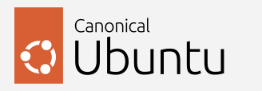
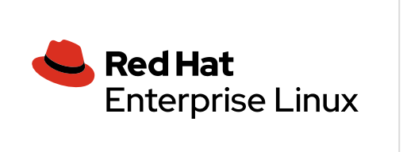
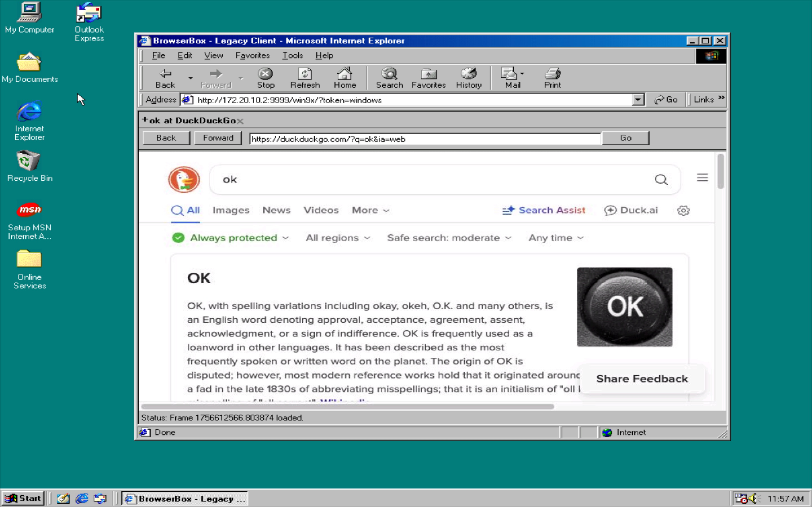
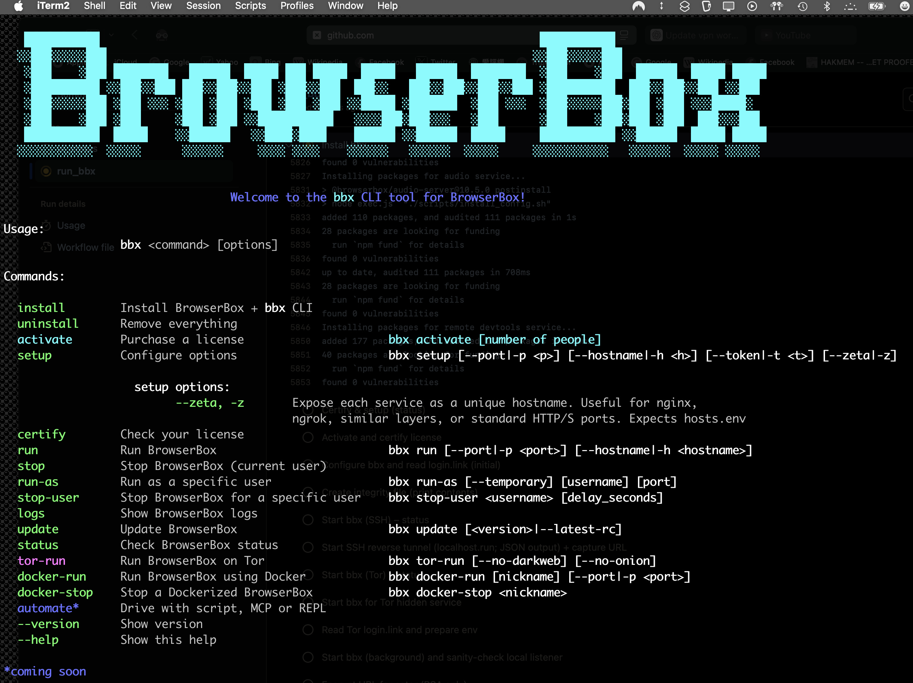

<p align="center">
  
</p>

<h1 align="center">BrowserBox by DOSAYGO</h1>

<p align="center">
  <strong>Secure Your Digital World with Enterprise-Grade Remote Browser Isolation (RBI)</strong>
</p>

<p align="center">
  <a href="https://dosaygo.com#license"></a>
  <a href="https://dosaygo.com"></a>
  <a href="https://dosaygo.com/nist800-53.html"></a>
  <a href="https://dosaygo.com/hipaa.html"></a>
  <a href="https://dosaygo.com/dlp.html"></a>
  <br>
  <a href="https://github.com/BrowserBox/BrowserBox/actions/workflows/bbx-saga.yaml"></a>
  <a href="https://github.com/BrowserBox/BrowserBox/actions/workflows/basic-install.yaml"></a>
</p>

<p align="center">
  <strong>COMING SOON:</strong>New Pricing!
  <br>
  <strong>SEPTEMBER 2025 NEWS: New <a href=LICENSE.md>License Agreement</a></strong>. What's changed: stricter consequences for unauthorized use.</strong>
  <br>
  <strong>AUGUST 2025 NEWS: Browse the Future from the Past!<br>Windows 9x support is now in beta.<br>Bring safe modern browsing to legacy Win 9x systems and browsers.<br>See the <a href=#platform-compatibility>compatibility table</a> for details.</strong>
</p>

BrowserBox delivers cutting-edge remote browser isolation (RBI) technology, protecting your organization from web-based threats while empowering your team with seamless, secure browsing. **A product key is required for all BrowserBox usage.**

Unlock advanced security, ensure compliance, and boost productivity today!

```ansi

   ███████████                                                                ███████████
  ░░███░░░░░███                                                              ░░███░░░░░███
   ░███    ░███ ████████   ██████  █████ ███ █████  █████   ██████  ████████  ░███    ░███  ██████  █████ █████
   ░██████████ ░░███░░███ ███░░███░░███ ░███░░███  ███░░   ███░░███░░███░░███ ░██████████  ███░░███░░███ ░░███
   ░███░░░░░███ ░███ ░░░ ░███ ░███ ░███ ░███ ░███ ░░█████ ░███████  ░███ ░░░  ░███░░░░░███░███ ░███ ░░░█████░
   ░███    ░███ ░███     ░███ ░███ ░░███████████   ░░░░███░███░░░   ░███      ░███    ░███░███ ░███  ███░░░███
   ███████████  █████    ░░██████   ░░████░████    ██████ ░░██████  █████     ███████████ ░░██████  █████ █████
  ░░░░░░░░░░░  ░░░░░      ░░░░░░     ░░░░ ░░░░    ░░░░░░   ░░░░░░  ░░░░░     ░░░░░░░░░░░   ░░░░░░  ░░░░░ ░░░░░


				 Welcome to the bbx CLI tool for BrowserBox!

Usage:
		 bbx <command> [options]

Commands:

  install        Install BrowserBox + bbx CLI
  uninstall      Remove everything
  activate       Purchase a license			bbx activate [number of people]
  setup          Configure options 			bbx setup [--port|-p <p>] [--hostname|-h <h>] [--token|-t <t>] [--zeta|-z]

  		   setup options:
         	         --zeta, -z       Expose each service as a unique hostname. Useful for nginx,
         	                          ngrok, similar layers, or standard HTTP/S ports. Expects hosts.env
  certify        Check your license
  run            Run BrowserBox 			bbx run [--port|-p <port>] [--hostname|-h <hostname>]
  stop           Stop BrowserBox (current user)
  run-as         Run as a specific user 		bbx run-as [--temporary] [username] [port]
  stop-user      Stop BrowserBox for a specific user 	bbx stop-user <username> [delay_seconds]
  logs           Show BrowserBox logs
  update         Update BrowserBox       		bbx update [<version>|--latest-rc]
  status         Check BrowserBox status
  tor-run        Run BrowserBox on Tor      		bbx tor-run [--no-darkweb] [--no-onion]
  docker-run     Run BrowserBox using Docker 		bbx docker-run [nickname] [--port|-p <port>]
  docker-stop    Stop a Dockerized BrowserBox 		bbx docker-stop <nickname>
  automate*      Drive with script, MCP or REPL
  --version      Show version
  --help         Show this help

*coming soon
```

---

## Table of Contents

1.  [Why Choose BrowserBox?](#why-choose-browserbox)
2.  [Key Benefits](#key-benefits)
3.  [Get Your License & Start Today!](#get-your-license--start-today)
4.  [Who Needs BrowserBox?](#who-needs-browserbox)
5.  [Core Features](#core-features)
6.  [See It In Action](#see-it-in-action)
7.  [Supported Network Topologies](#supported-network-topologies)
8.  [Platform Compatibility](#platform-compatibility)
9.  [Get Started in 3 Steps](#get-started-in-3-steps)
    *   [1. Install the `bbx` CLI](#1-install-the-bbx-cli)
    *   [2. Purchase & Obtain Your Product Key](#2-purchase--obtain-your-product-key)
    *   [3. Activate & Run BrowserBox](#3-activate--run-browserbox)
10.  [Meet `bbx`: Your BrowserBox Command Center](#meet-bbx-your-browserbox-command-center)
11. [Embed BrowserBox Anywhere](#embed-browserbox-anywhere)
12. [Advanced Usage](#advanced-usage)
13. [License Compliance & Usage Data](#license-compliance--usage-data)
14. [Frequently Asked Questions (FAQ)](#frequently-asked-questions-faq)
15. [Support](#support)
16. [About DOSAYGO](#about-dosaygo)
17. [Sponsors](#sponsors)
18. [Copyright & Licensing](#copyright--licensing)

---

## Why Choose BrowserBox?

In today's threat landscape, standard browsing is a significant risk. BrowserBox provides a secure, isolated environment that neutralizes web-based threats *before* they reach your network or endpoints. It's an essential tool for:

*   **Protecting Sensitive Data:** Ideal for handling confidential information in healthcare (HIPAA), finance, and government (NIST 800-53).
*   **Secure Automation:** Safely automate web interactions, even with sensitive data.
*   **Compliance & DLP:** Meet stringent regulatory requirements and prevent data loss.
*   **Developer Productivity:** Easily embed secure browsing into applications.

## Key Benefits

*   **Unmatched Security:** Stop malware, ransomware, and zero-day attacks. Prevent costly data breaches.
*   **Effortless Integration:** Clientless RBI works in any browser. Embed secure browsing into your apps or protect local tabs with zero friction.
*   **Cross-Platform Power:** Runs on Windows, Linux (Debian, Ubuntu, RHEL, CentOS, NixOS), Docker, and LXC.
*   **Productivity Boost:** Features like Zero Latency Mode, customizable policies, and a mobile-first experience are built for modern teams.
*   **Developer Friendly:** Powerful `bbx` CLI and an easy-to-use Embedding API.

## Get Your License & Start Today!

BrowserBox requires a license for all use. Choose the option that's right for you:

*   🚀 **[Get a Commercial License](https://dosaygo.com/commerce)** - Starting at $99/user/year. Volume discounts available.
*   🌍 **[Get a Non-Commercial License](https://dosaygo.com/noncommercial)** - $39/user/year for non-profits, and government.
*   🧪 **[Request a Demo](mailto:sales@dosaygo.com?subject=Demo)** - Experience the full power of BrowserBox.
*   🛡️ **[Explore Solutions for Regulated Industries](https://dosaygo.com/regulated-enterprise.html)** - HIPAA, NIST 800-53, DLP, and more.

>[!CAUTION]
>Unlicensed instances will display a warning and shut down after a brief period. Ensure you have a valid product key for uninterrupted use.

## Who Needs BrowserBox?

*   **Businesses & Enterprises:** Safeguard your network, data, and employees from web-based threats.
*   **Regulated Industries (Healthcare, Finance, Government):** Ensure compliance (HIPAA, NIST 800-53), protect sensitive data, and implement robust DLP.
*   **Developers & Integrators:** Embed secure, isolated browsing directly into your applications and workflows.
*   **IT & Security Teams:** Deploy a scalable, manageable, and powerful RBI solution quickly.
*   **Automation Specialists:** Securely run Puppeteer & Playwright scripts in an isolated environment.

## Core Features

*   **Clientless Remote Browser Isolation (RBI):** No downloads or plugins needed for end-users. Access from any modern web browser.
*   **Comprehensive Platform Support:** Windows, major Linux distributions, Docker, LXC.
*   **Powerful `bbx` CLI Tool:** Manage installations, licenses, users, and run modes (including Tor).
*   **Easy Embedding API:** Integrate BrowserBox into your web applications with a simple `<browserbox-webview>` custom element.
*   **Automation Ready:** Designed for use with Puppeteer (PPtr) and Playwright (support coming soon).
*   **Security Focused:** Built-in DLP features, Tor support for anonymity, and robust access controls.
*   **1-Click Cloud Deployment (Coming Soon):** Easily deploy on Vultr, AWS, Azure, or Linode.

## See It In Action

BrowserBox provides a full-featured, secure browsing experience:

<div align="center">
  <figure style="display: inline-block; margin: 10px;">
    
    <figcaption>Secure Web Browsing</figcaption>
  </figure>
  <figure style="display: inline-block; margin: 10px;">
    
    <figcaption>Seamless PDF Viewing</figcaption>
  </figure>
  <figure style="display: inline-block; margin: 10px;">
    
    <figcaption>Powerful DevTools</figcaption>
  </figure>
  <figure style="display: inline-block; margin: 10px;">
    
    <figcaption>Full Browser Features (File Uploads, etc.)</figcaption>
  </figure>
</div>

# Supported Network Topologies

🌐 **Unlock Any Network Scenario with BrowserBox** – Whether you're a SD-WAN architect optimizing enterprise connectivity, a NAT traversal expert punching through firewalls, a WiFi specialist ensuring seamless access on the go, or a NOC pro managing mission-critical operations, BrowserBox delivers unmatched flexibility. From massive country-scale deployments to secure homelab setups, our platform adapts to virtually every operating system, client device, and networking topology you'll encounter. Run it headless on servers without a graphical display or GPU for efficient, low-footprint ops—or leverage full GPU acceleration and manual graphical displays when you need visual power. BrowserBox isn't just software; it's an all-in-one toolkit for secure, scalable remote browser access that fits *your* environment, not the other way around. From mesh to edge, from overlay to backbone — BrowserBox works with it all. 🚀

### Comprehensive Topology Compatibility at a Glance

Here's the core of what makes BrowserBox a networking powerhouse—a detailed table of our supported topologies. We've got you covered from simple HTTP setups to advanced overlay networks, with zero-compromise reliability across platforms. (And stay tuned: Native support via the `bbx` CLI is coming soon for NGINX, Cloudflare Tunnels, and ZeroTier on all platforms, plus automated SSH port forwarding with built-in certificate management and orchestration. Get ready for even smoother integrations! 🎉)

| Topology | Description | Public Access? | Key Features & Benefits | OS Support (Ubuntu/macOS/Windows) | Best For |
|----------|-------------|----------------|--------------------------|------------------------------------|----------|
| **HTTP Only** | Basic unencrypted HTTP connections for quick, lightweight access. | Yes (if exposed) | Simple setup; ideal for internal testing or low-security demos. Supports custom ports (e.g., 8080, 9999, 11111) or standard (80). | ✅ / ✅ / ✅ | Rapid prototyping in trusted networks. |
| **HTTP/WS** | HTTP with WebSocket support for real-time bidirectional communication. | Yes (if exposed) | Enables interactive apps; pairs with custom/standard ports for flexibility. | ✅ / ✅ / ✅ | Chat apps, live updates, or collaborative tools. |
| **HTTPS/WSS/WebRTC** | Secure HTTPS with WebSocket Secure and WebRTC for encrypted, peer-to-peer media streaming. | Yes (if exposed) | End-to-end encryption; auto-cert handling; custom/standard ports (443 default). | ✅ / ✅ / ✅ | Video calls, secure file sharing, or real-time collaboration in production. |
| **Tor/HTTP** | Tor onion service over HTTP for pseudonymous access. | Yes (via .onion) | High privacy; bypasses censorship; slow but reliable. Requires Tor Browser. | ✅ / ✅ / ✅ | Privacy-focused demos or restricted environments. |
| **Tor/HTTPS** | Secure Tor onion service with HTTPS encryption. | Yes (via .onion) | Adds TLS to Tor for extra security; reliable NAT traversal. | ✅ / ✅ / ✅ | Anonymous secure access in high-threat scenarios. |
| **SSH Port Forward, HTTP** | SSH-based port forwarding tunneling HTTP traffic. | No (private) | Secure, low-latency; forwards to custom/standard ports. Upcoming auto-cert orchestration. | ✅ / ✅ / ✅ | Private homelab access or secure internal routing. |
| **SSH Port Forward, HTTPS** | SSH forwarding with HTTPS for encrypted tunnels. | No (private) | Combines SSH reliability with TLS; flexible port options. Native enhancements incoming. | ✅ / ✅ / ✅ | Enterprise-grade secure remote sessions. |
| **Custom Ports** | User-defined ports (e.g., 8080, 9999, 11111) across any protocol. | Varies | Total control; avoids conflicts; integrates with all topologies. | ✅ / ✅ / ✅ | Tailored setups for specialized apps or multi-service hosts. |
| **Standard Ports** | Default ports (e.g., 80 for HTTP, 443 for HTTPS) for seamless compatibility. | Varies | Plug-and-play; reduces config overhead in standard environments. | ✅ / ✅ / ✅ | Quick deployments matching common infrastructure. |
| **Cloudflare Tunnel** | HTTPS DNS facade with port relay via Cloudflare's edge network. | Yes (*.trycloudflare.com) | Auto-install; high reliability; great perf. Native `bbx cf-run` support soon. | ✅ / ✅ / ✅ | Quick public demos with origin privacy. |
| **localhost.run** | SSH reverse tunnel with HTTPS facade. | Yes (http(s)://…lhr.life) | Zero-config; medium reliability; occasional interstitials. | ✅ / ✅ / ✅ | Free, easy links for casual sharing. |
| **ngrok** | Port relay with HTTPS and auth token for secure exposure. | Yes (*.ngrok-free.app) | High perf; webhooks ready; free tier limits (1 tunnel). Token required. | ✅ / ✅ / ✅ | Shareable demos and webhook testing. |
| **Pinggy** | Port relay with HTTPS; may have interstitials. | Yes (*.pinggy.io) | Fair reliability; okay perf. | ✅ / ✅ / ℹ️ (Limited on Windows) | Budget-friendly webhooks and demos. |
| **Tailscale** | Overlay network for private, LAN-like access. | No (private tailnet) | Very high reliability; low latency. SSH forwarding; token required. Less stable on Windows/VPN. | ✅ / ✅ / ℹ️ (SSH not upstream-supported on Windows) | Private team debugging and access. |
| **Tor** | Onion routing for pseudonymous, reliable access. | Yes (.onion) | Extremely reliable (but slow); privacy-first. We already have `bbx tor-run`. | ✅ / ✅ / ✅ | Censorship-resistant, anonymous deployments. |
| **Tunnelmole** | OSS ngrok-style relay with HTTPS. | Yes (https://…tunnelmole.net/.com) | High reliability; good perf; auto-install. | ✅ / ✅ / ✅ | Open-source demos with easy URLs. |
| **ZeroTier** | Overlay network for peer-to-peer private access. | No (private network) | LAN-like; very high reliability. Native `bbx zt-run` support soon. Tokens required; client on access device. | ✅ / ✅ / ✅ | Secure P2P demos in overlays. |

**Notes on Flexibility & Power:**
- **Headless or Graphical? Your Call.** BrowserBox thrives on headless machines—no display or GPU needed for core ops—making it perfect for servers or cloud instances. But when you want it, tap into GPU acceleration for heavy rendering or enable manual graphical displays for hands-on control. Scale from a single homelab box to nationwide rollouts without missing a beat. 💪
- **Why BrowserBox Wins Networks:** In a world of rigid tools, BrowserBox stands out by embracing *every* topology. Punch through NAT with ease, integrate with SD-WAN for optimized routing, ensure WiFi stability for mobile pros, and give NOC teams the configurability to monitor and manage at scale. It's not just supported—it's battle-tested for real-world wins. Ready to deploy? Fork, configure, and conquer! 🌍

  
## Platform Compatibility

BrowserBox runs seamlessly across a wide range of operating systems and containerization technologies:

| Platform                 | Supported | Icon                                                                                                |
| :----------------------- | :-------- | :-------------------------------------------------------------------------------------------------- |
| Tails\*                  | ❌        |     |
| Windows & Windows Server | ✅        |     |
| Debian                   | ✅        |                            |
| Ubuntu                   | ✅        |                            |
| CentOS Stream            | ✅        |              |
| RHEL                     | ✅        |              |
| NixOS                    | ✅        |                              |
| Docker                   | ✅        |                            |
| LXC                      | ✅        |                                    |
| Podman‡                  | 🚧        |                            |
| Windows 9x†              | ✅        |               |

>[!NOTE]
>Run `bbx` (or `bbx install` on Windows) to ensure you have the latest version (v13+) with all fixes and features.

**Notes**

- \*Tails is not supported because neither Chrome nor Docker can be installed.
- ‡Podman support is currently under consideration.
- †Windows 9x clients are supported by running the **new** `win9x_bbpro` command which will output the login link for legacy Windows clients (such as Internet Explorer (IE 5, IE 6, etc) or Netscape. Supported Windows 9x operating systems for legacy clients include Windows 95, Windows 98, Windows 2000, Windows NT the BrowserBox server must still be run on a modern system, but now you can connect to BrowserBox from legacy Windows 9x machines and browsers. Modern clients can still use the legacy endpoint but the experience is understandably jurassic.

<p align=center>
  
</p>

## Get Started in 3 Steps

### 1. Install the `bbx` CLI

The `bbx` command-line interface is your primary tool for managing BrowserBox.

*   **Windows:**
    ```powershell
    irm bbx.dosaygo.com | iex
    ```
*   **Linux (Debian, Ubuntu, CentOS, RHEL, NixOS) & macOS & Docker:**
    ```bash
    bash <(curl -sSL https://bbx.sh.dosaygo.com) install
    ```
*   **Via NPM (@browserbox/browserbox):**
    ```bash
    npm i -g @browserbox/browserbox
    bbx-install
    ```

### 2. Purchase & Obtain Your Product Key

A product key is required.
*   **Commercial Use:** Starts at $99/user/year. [Purchase Commercial License](https://dosaygo.com/commerce).
*   **Non-Commercial Use:** $39/user/year (for non-profits, government). [Purchase Non-Commercial License](https://dosaygo.com/noncommercial).
*   **Evaluation:** [Request a Demo](mailto:sales@dosaygo.com?subject=Demo).

You can also purchase directly via the `bbx` CLI on Linux/macOS:
```console
bbx activate [number of people]
```

>[!IMPORTANT]
>After purchase, you'll receive an email with a secure link to view your **Product Key**. Save it safely; the link is single-use. Lost keys can be re-issued by contacting [Support](mailto:support@dosaygo.com) (evaluation keys cannot be rolled).

### 3. Activate & Run BrowserBox

*   **Windows:** Set the `LICENSE_KEY` environment variable:
    ```powershell
    $Env:LICENSE_KEY = "YOUR_BROWSERBOX_PRODUCT_KEY"
    ```
*   **Linux/macOS:** Use `bbx certify` to enter and save your Product Key (if not already saved via `bbx activate`).
    ```console
    bbx certify YOUR_BROWSERBOX_PRODUCT_KEY
    ```

Then, start BrowserBox:
```console
bbx setup  # Run once for initial configuration
bbx run
```
Access BrowserBox using the **Login Link** provided in your console. For public internet access, ensure your DNS records are configured correctly. View logs with `bbx logs` and stop with `bbx stop`.

---

## Meet `bbx`: Your BrowserBox Command Center

<a href="#meet-bbx-your-browserbox-command-center"></a>

The `bbx` CLI simplifies every aspect of BrowserBox management:

*   ✅ **Easy Installation & Updates:** `bbx install`, `bbx update`
*   💳 **License Management:** `bbx activate [number of seats]`, `bbx certify [product key]`
*   👩‍💻 **Multi-User Support:** Run BrowserBox for multiple users on a single machine.
*   🐳 **Docker Integration:** `bbx docker-run`
*   🧅 **Tor Anonymity:** `bbx tor-run`
*   ⚙️ **Core Operations:** `bbx run`, `bbx stop`, `bbx logs`, `bbx setup`
*   🌟 **And much more!** Run `bbx --help` for a full list of commands on your OS.

---

## Embed BrowserBox Anywhere

Easily integrate secure, remote browsing into your web applications using the BrowserBox Embedding API. Our `<browserbox-webview>` custom element allows you to add a fully isolated browser to any webpage.

**Quick Start:**

1.  **Configure Server:** Set `ALLOWED_EMBEDDING_ORIGINS` on your BrowserBox server:
    ```bash
    export ALLOWED_EMBEDDING_ORIGINS="https://your-embedding-site.com"
    bbx run
    ```
2.  **Add to HTML:** Include the script and element in your webpage:
    ```html
    <script src="https://raw.githubusercontent.com/BrowserBox/BrowserBox/main/api/browserbox-webview.js"></script>
    <browserbox-webview login-link="https://your-browserbox-instance.com/login/abc123" width="800" height="600"></browserbox-webview>
    ```
For more details, see the [browserbox-webview.js file](https://github.com/BrowserBox/BrowserBox/blob/main/api/browserbox-webview.js).

---

## Advanced Usage

*   **Secure Document Viewing:** Safely preview files without downloading them to the client device (Linux only).
*   **Developer Tools Access:** Inspect remote pages by right-clicking within the BrowserBox session.
*   **Tor & SSH Tunneling:** Enhance privacy and anonymity. Refer to the [Advanced Setup Guide](ADVANCE.md) (Note: `ADVANCE.md` link needs to be created or pointed correctly).

---

## License Compliance & Usage Data

BrowserBox requires a valid license for all deployments. We utilize usage data solely to ensure license compliance and for operational purposes. We never sell your data.
Please review our [Privacy Policy](https://dosaygo.com/privacy.txt.html) and [Terms of Service](https://dosaygo.com/terms.txt.html).

>[!IMPORTANT]
>A valid license unlocks all features, ensures ongoing support, and guarantees a secure, compliant solution.

---

## Frequently Asked Questions (FAQ)

**Q: Why is a license required for BrowserBox?**
A: Licensing supports continuous development, maintenance, and the advanced security features BrowserBox provides. It ensures we can deliver a robust, enterprise-grade RBI solution.

**Q: Do you offer perpetual licenses (non-subscription, version-locked)?**
A: Yes, for enterprise clients with an Annual Contract Value (ACV) of $150K+. Please contact [sales@dosaygo.com](mailto:sales@dosaygo.com) for inquiries.

**Q: How does BrowserBox compare to other RBI solutions?**
A: BrowserBox uniquely combines enterprise-grade security, extensive cross-platform compatibility (including Docker and multiple OS), an easy-to-use embedding API, and a powerful CLI, all in one package.

**Q: What do I receive when I purchase a license?**
A: You'll get an email with a secure, one-time link to view your product key. This key is valid for the number of seats purchased (adjustable during checkout). This is the same as the number of people who will use BrowserBox in your product or organization. For high volume or to negotiate custom pricing reach out to us. 

**Q: How can I purchase more licenses or get volume discounts?**
A: Volume discounts are available for commercial licenses and are automatically applied on our payment page. For custom packages or questions, contact [sales@dosaygo.com](mailto:sales@dosaygo.com). Non-commercial licenses have a flat rate.

**Q: I may have used BrowserBox without a license in the past. How can I become compliant?**
A: We understand situations can be complex. Please contact [legal@dosaygo.com](mailto:legal@dosaygo.com) to discuss your situation and achieve compliance. We're here to help you get on the right track.

**Q: Where can I find more information or ask other questions?**
A: Visit [dosaygo.com](https://dosaygo.com) or email [sales@dosaygo.com](mailto:sales@dosaygo.com).

---

## Support

Need help? Our team is ready to assist.
*   **Technical Support:** [support@dosaygo.com](mailto:support@dosaygo.com)
*   **Sales & Licensing:** [sales@dosaygo.com](mailto:sales@dosaygo.com)
*   **GitHub Issues:** For bug reports or feature requests related to the open-source components or `bbx` tool.

---

## About DOSAYGO

DOSAYGO (also known, due to an early incorporation typo, as DOSYAGO) is committed to building innovative and secure technology solutions. Our products include:
*   **BrowserBox:** Secure Remote Browser Isolation.
*   **DiskerNet:** Technology for creating offline archives of web content.

Visit us at [dosaygo.com](https://dosaygo.com).

---

## Copyright & Licensing

BrowserBox™ is &copy; 2018-2025 DOSAYGO Corporation USA. All rights reserved.
The `bbx` CLI tool and other specified components are under the [LICENSE.md](LICENSE.md) in this repository. You need a license agreement to use this product. Purchase licenses online at: https://dosaygo.com/commerce or reach out to sales@dosaygo.com to discuss your needs. The BrowserBox product requires a validly purchased license (either commercial for business and personal use, or non-commercial for public sector and non-profit). Your license comes with one or more license keys and a number of seats. 

---

<p align="center">
  <strong>Ready to secure your browsing?</strong><br>
  <a href="https://dosaygo.com/commerce">Get Your Commercial License</a> | <a href="https://dosaygo.com/noncommercial">Get Your Non-Commercial License</a> | <a href="mailto:sales@dosaygo.com?subject=Demo">Request a Demo</a>
</p>
